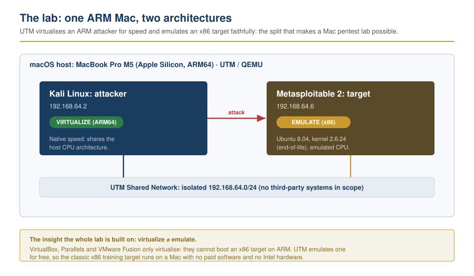
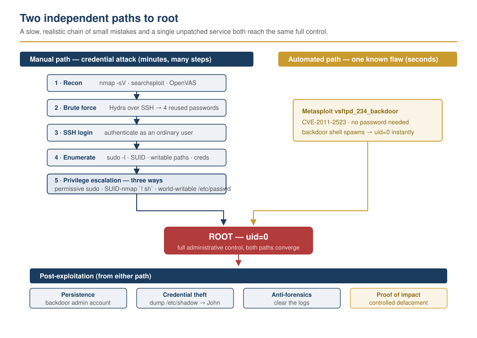
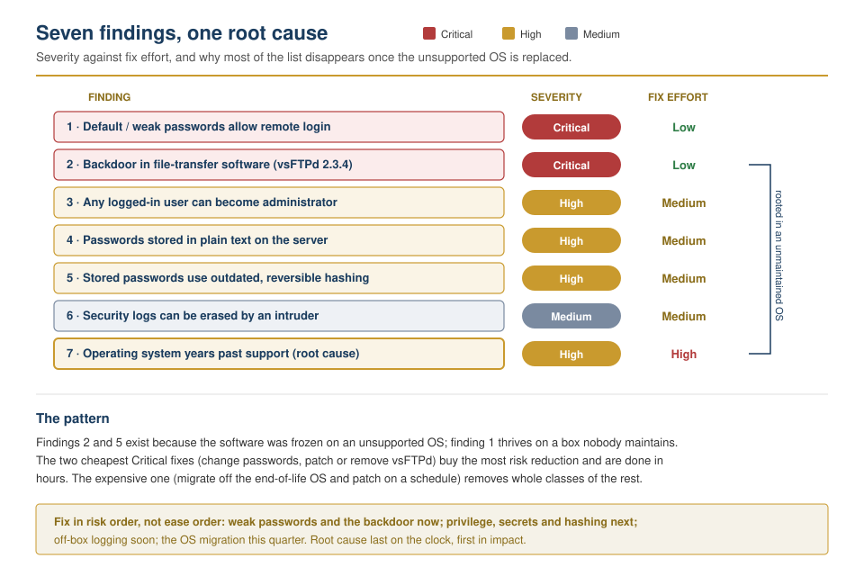

# Full compromise on Apple Silicon: two paths to root, one defensive mirror for every step

A complete penetration test built and run on an M-series Mac, the platform
every mainstream lab guide says cannot do it, against an intentionally
vulnerable target, taken to full administrative control two independent ways and
documented end to end. The compromise is not the point; the target was built to
fall. The point is the workflow around it: a reproducible lab, an evidence pack,
and an executive-readable report where every offensive step is paired with the
control that stops it.

## Context

The hard part of this lab had nothing to do with exploitation. It was getting an
x86 target to boot on an ARM Mac at all: the problem most guides quietly assume
away. VirtualBox cannot run x86 guests on Apple Silicon; Parallels and VMware
Fusion virtualise rather than emulate, and the entire training ecosystem of
vulnerable VMs is built for x86. The mismatch between an ARM host and an x86
target is the real obstacle, and solving it is the backbone of everything below.

The answer was [UTM](https://lawaloyinlola.com/blog/building-a-pentest-lab-on-apple-silicon), a free QEMU-based hypervisor that can do both:
**virtualise** an ARM-native Kali for speed, and **emulate** an x86
Metasploitable 2 target, slowly but faithfully, on the same machine and the same
isolated network. No paid software, no Intel hardware.

| Role     | Guest                  | Address      | UTM mode   |
| -------- | ---------------------- | ------------ | ---------- |
| Attacker | Kali Linux (ARM64)     | 192.168.64.2 | Virtualize |
| Target   | Metasploitable 2 (x86) | 192.168.64.6 | Emulate    |

Everything ran on a self-owned UTM Shared Network (`192.168.64.0/24`), NAT'd
through the Mac: segmented from the physical LAN, with outbound Internet for
package and vulnerability-feed updates but no inbound path from other machines. No
third-party system was ever in scope, and a clean disk snapshot was taken before
any testing so the target could be reset to a known state. The target,
Metasploitable 2, runs Ubuntu 8.04 (kernel 2.6.24), an operating system years
past end of life. Its weaknesses are deliberate, but each one mirrors a mistake
that shows up on real systems, which is what makes the findings transferable.

The question the lab set out to answer was not "can this box be broken". It was
built to break. It was: can a complete, standards-aligned testing workflow
(recon, exploitation, post-exploitation, reporting) be run entirely on Apple
Silicon, and documented well enough that a manager with no security background
can act on it?

## Action

The method followed a standard testing flow aligned to NIST SP 800-115 and PTES,
and the target was compromised two deliberately different ways to contrast a
slow, realistic human attack with a fast, brittle exploit of a single known
flaw. Every offensive step was written up with its defensive mirror.

- **Recon and scanning first.** Services mapped with `nmap -sV`, versions
  cross-referenced with `searchsploit`, and an OpenVAS/GVM scan run for a
  prioritised vulnerability list. This is where the end-of-life file-transfer
  service and its publicly documented backdoor first surfaced.
  _Evidence: [lab01-1_nmap-service-scan.webp](./evidence/lab01-1_nmap-service-scan.webp),
  [lab01-2_searchsploit-vsftpd.webp](./evidence/lab01-2_searchsploit-vsftpd.webp),
  [lab01-4_openvas-scan-results.webp](./evidence/lab01-4_openvas-scan-results.webp)._

- **Manual path: credential attack to full compromise.** Hydra brute-forced SSH
  with custom wordlists and found four accounts where the password equalled the
  username. After logging in as an ordinary user, the host was enumerated
  (`sudo -l`, SUID binaries, world-writable paths, plaintext credentials in the
  web root), then escalated to root three separate ways: a permissive `sudo`
  rule, the SUID-`nmap` interactive trick (`! sh`, with the space that the
  handoff notes is easy to miss), and a world-writable `/etc/passwd`. From root:
  a backdoor persistence account, `/etc/shadow` dumped and cracked offline with
  John the Ripper, then the logs cleared.
  _Evidence: [lab02-2b_hydra-bruteforce.webp](./evidence/lab02-2b_hydra-bruteforce.webp),
  [lab02-3_ssh-login-verified.webp](./evidence/lab02-3_ssh-login-verified.webp),
  [lab02-4a_enumeration-suid-writable.webp](./evidence/lab02-4a_enumeration-suid-writable.webp),
  [lab02-5a_sudo-privesc-root.webp](./evidence/lab02-5a_sudo-privesc-root.webp),
  [lab02-6_persistence-and-harvest.webp](./evidence/lab02-6_persistence-and-harvest.webp),
  [lab02-7_hash-dump-shadow.webp](./evidence/lab02-7_hash-dump-shadow.webp),
  [lab02-8b_log-clearing.webp](./evidence/lab02-8b_log-clearing.webp)._

- **Automated path: one known flaw to instant root.** Metasploit's
  `vsftpd_234_backdoor` module (CVE-2011-2523) opened a root session in seconds,
  no password required. The contrast with the manual path is the lesson: one is
  a patient chain of small mistakes, the other a single unpatched service.
  _Evidence: [lab03-1_metasploit-full-flow.webp](./evidence/lab03-1_metasploit-full-flow.webp)._

- **Proof of impact: a controlled defacement.** The target's web page was
  replaced with a hand-built, pure-CSS page (no JavaScript): a typing animation
  that spells "I AM LAWAL," mirrors each letter, and resolves into a compromise
  banner. The original page was backed up first and restored afterwards:
  limiting impact and preserving the original is standard professional practice,
  and the front-end craft is deliberate carryover from my engineering
  background.
  _Evidence: [lab02-9b_web-defaced.webp](./evidence/lab02-9b_web-defaced.webp),
  [lab02-9c_defacement-animation.mp4](./evidence/lab02-9c_defacement-animation.mp4)._

- **Kept the evidence reproducible.** Every step is captured in the evidence
  pack and reconstructable from the [full lab guide](./pentest-lab.md), down to
  the UTM snapshot commands, the legacy-SSH algorithm block the 2008-era target
  needs, and the one-shot nature of the vsFTPd backdoor under emulation.

## Result

Both paths reached full administrative control (root). That was expected: the
target is deliberately weak. What matters is what the compromise demonstrated and
how it maps to fixes. Once inside, an intruder could do everything that defines a
real breach: establish persistence with a hidden account, read and crack the
password database, harvest plaintext credentials, and erase the logs that would
reveal any of it.

The findings resolve to a single root cause. Default and weak passwords, a
backdoored file-transfer service, trivial privilege escalation, plaintext
secrets, and reversible password hashing are not seven unrelated problems: most
of them exist because the software was frozen in time on an unsupported operating
system. Fix the age and neglect and whole classes of finding disappear.

| #   | Finding                                                      | Severity | Fix effort |
| --- | ------------------------------------------------------------ | -------- | ---------- |
| 1   | Default / weak passwords allow remote login                  | Critical | Low        |
| 2   | Known backdoor in file-transfer software (vsFTPd 2.3.4)      | Critical | Low        |
| 3   | Any logged-in user can become administrator                  | High     | Medium     |
| 4   | Passwords stored in plain text on the server                 | High     | Medium     |
| 5   | Stored passwords use outdated, easily-reversed hashing       | High     | Medium     |
| 6   | Security logs can be erased by an intruder                   | Medium   | Medium     |
| 7   | Operating system is years past its support date (root cause) | High     | High       |

The defensive mirror is the real output. Every offensive step above has a named,
prioritised, verifiable control behind it: remove default accounts and require
strong unique passwords with lockout and MFA (Finding 1); patch or remove the
vulnerable service and run a patch schedule (Findings 2, 7); least-privilege
`sudo`, drop needless SUID bits, correct file permissions (Finding 3); a secrets
manager and credential rotation (Finding 4); a modern slow hash and a restricted
shadow file (Finding 5); and ship logs off-box to a SIEM with tamper alerting
(Finding 6). The two things done well, a clean pre-test snapshot and backing up
the web page before defacing it, are called out too, because good habits are
worth naming. Full detail, with proof, fix, and a verification step for each
finding, is in the [executive findings report](./report.pdf).

## What this demonstrates

This lab is the offensive counterpart to the defensive work elsewhere in this
portfolio, and it is built to the same standard: the artifact is the
documentation, not the exploit. It shows I can run a full engagement (recon,
credential attack, enumeration, privilege escalation, persistence, credential
theft, anti-forensics, and automated exploitation), and then, more importantly,
translate it into something an organisation can act on: an executive-readable
report that still gives engineers concrete, verifiable fixes, each tied to the
attack path it closes.

It also demonstrates the engineering carryover that defines my pivot into
security. Solving the ARM-versus-x86 boot problem with UTM's virtualise/emulate
split, re-enabling exactly the legacy SSH algorithms the old target needs without
the one (`ssh-dss`) that newer OpenSSH removed, and hand-building a pure-CSS
proof-of-impact page are all the same instinct: understanding how the machine
actually works, which is what lets you find where it breaks and how to fix it.

## Source materials

The complete, reproducible record lives in this directory:

- **[analysis.md](./analysis.md):** this writeup.
- **[report.md](./report.md) / [report.pdf](./report.pdf):** the executive
  findings report: what / why / proof / fix / verify, prioritised and
  standards-aligned.
- **[pentest-lab.md](./pentest-lab.md):** the full step-by-step lab guide, every
  command, both attack paths, and the Apple Silicon gotchas.
- **[Published blog post](https://lawaloyinlola.com/blog/building-a-pentest-lab-on-apple-silicon):** the write-up (the lab build, the seven phases walked end to end, and the defacement).
- **[Live lab writeup](https://lawaloyinlola.com/security/labs/building-a-pentest-lab-on-apple-silicon):** this piece, published on the portfolio site.
- **[Findings report (hosted PDF)](https://lawaloyinlola.com/files/apple-silicon-pentest-lab-report.pdf):** the executive report as a downloadable PDF.
- **[LinkedIn briefing](https://lnkd.in/p/dWJJqyUw):** the short public write-up of this lab.
- **[artifacts/](./artifacts):** the pure-CSS proof-of-impact page (`deface.php`)
  and its no-PHP preview twin.
- **[wordlists/](./wordlists):** the `userlist.txt` and `passlist.txt` used by
  Hydra.
- **[evidence/](./evidence):** the full screenshot pack (`lab00-*` setup through
  `lab03-*` Metasploit) and the defacement animation.
- **[lab-architecture.svg](./lab-architecture.svg)**,
  **[two-paths-to-root.svg](./two-paths-to-root.svg)**, and
  **[findings-to-root-cause.svg](./findings-to-root-cause.svg):** the diagrams
  above, as standalone files.
