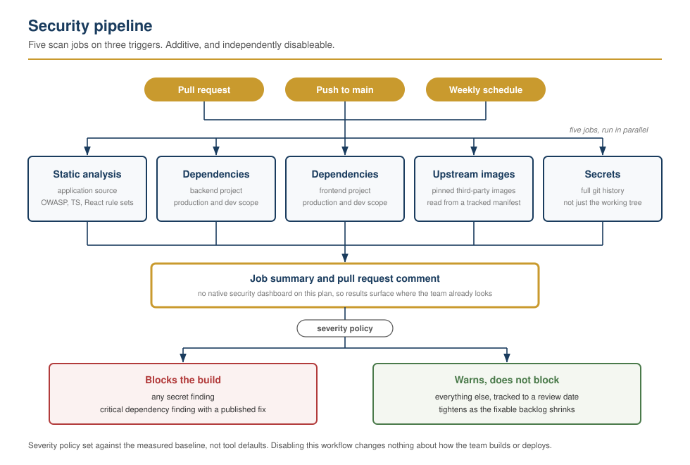
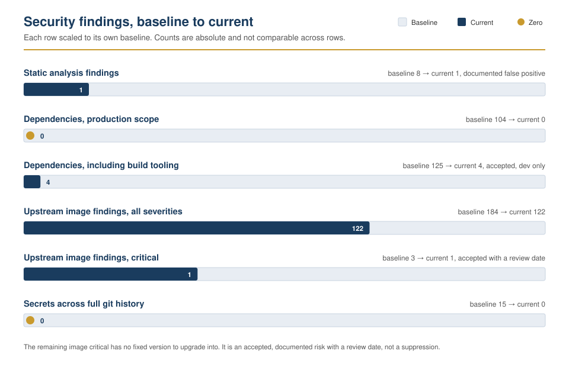

# CI/CD security pipeline: scanning, policy, and a gate that caught its own bug

Automated security scanning added to a live, self-hosted SaaS product without
disturbing its existing build or deploy workflows. Working from a baseline scan
of the untouched codebase, I built a policy-driven pipeline, triaged every
finding to a fix or a documented decision, and caught the pipeline itself
failing open on a cancelled scan, days after building it.

## 📖 Context

The target is a self-hosted SaaS product on a NestJS backend and a Next.js
frontend, deployed on a single VPS for a small team already shipping features.
It handles location data on real people, so the margin for error was
genuinely low. Two GitHub Actions workflows already ran the team's build and
deployment. The brief was to add meaningful security coverage without touching
either: audit first, then build, and keep the private engineering record
separate from this public writeup.

## ⚙️ Action

<picture>
  <source media="(prefers-color-scheme: dark)" srcset="./pipeline-diagram-dark.svg">
  
</picture>

- **Audited before building.** The deployment was described as containerized;
  it was not. Only an upstream, third-party service runs in a container, and
  its configuration lives on the server, not the repository. That correction
  changed how dependency and image scanning had to be scoped.
- **Baselined before adding anything.** Static analysis, dependency and
  container scanning, and a full git-history secrets scan, run against the
  repository exactly as it stood. The history scan found a live credential:
  a webhook secret logged in plaintext by a debug statement and committed.
  Rotated immediately, before any pipeline work continued.
- **Read the application code directly**, not just scanner output. Three
  separate development conveniences were gated on a request header, or on
  nothing at all, instead of on the runtime environment, and all three were
  live in production. No scanner reported any of them.
- **Built the pipeline as policy, not defaults.** Static analysis, dependency
  scanning across both projects, container scanning against pinned upstream
  images, and secrets scanning, on pull request, push to main, and a weekly
  schedule. Additive and independently disableable: turning it off changes
  nothing about how the team ships.
- **Set severity by baseline, not dogma.** Blocking on any high-severity
  finding would have failed every pull request from day one and gotten the
  pipeline disabled within a week. The policy blocks on secrets, on
  error-severity static analysis findings, and on critical dependency
  vulnerabilities with a published fix; everything else warns and is tracked
  to a review date.
- **Triaged every finding individually**: fixed, accepted with a written,
  technically grounded reason and a review date, or classified false positive
  with the reasoning stated. No bare suppressions.

## ✅ Result

| Category | Before | After |
| --- | --- | --- |
| Static analysis findings | 8 | 1 (documented false positive) |
| Dependency vulnerabilities, production scope | 104 | 0 |
| Dependency vulnerabilities, including build tooling | 125 | 4 (accepted, dev-only) |
| Upstream container image vulnerabilities | 184 | 122 |
| Of which critical | 3 | 1 (accepted, documented) |
| Secrets across full git history | 15 | 0 |

<picture>
  <source media="(prefers-color-scheme: dark)" srcset="./findings-before-after-dark.svg">
  
</picture>

The one remaining critical is an unpatched vulnerability inside a helper
binary in the upstream database image, used only to drop privileges at
container start with fixed, non-attacker-controlled input, before the
database accepts connections. Every available image version ships the same
component; there is no fix to upgrade into. Tracked with a review date
instead of hidden by suppression.

The most useful finding was not in the application. A concurrency setting
meant to stop duplicate scans cancelled an in-flight security scan on the
exact commit a deploy gate was waiting on. The gate checked for two specific
failure outcomes and did not recognise a cancellation as one of them, so it
treated the cancelled scan as a pass and let the deploy through. No vulnerable
code reached production, because the same commit had already been scanned
clean earlier, but the gap was real: a commit that genuinely failed its scan
could have received the identical free pass. Fixed on both sides, cause and
logic separately: the setting that produced the cancellation was corrected,
and the gate's check changed from listing bad outcomes to requiring the one
good one, since an allow-list of failure modes is incomplete by construction
and requiring explicit success is not.

_The complete pipeline configuration: [security.yml](./security.yml)_

## 🧠 What this demonstrates

This is the build-focused, engineering-led security work described in the
root README: hardening a CI/CD pipeline on a real product, not monitoring
alerts on someone else's. The tooling, Semgrep, Trivy, Gitleaks, and GitHub
Actions, is the same list named there; the judgment applied to it is the
point of the lab. A generic severity policy would have gotten this pipeline
disabled in a week. A generic scanning scope would have missed that the
deployment was not what it was assumed to be. Finding a fail-open defect in a
gate I had built days earlier, and writing it up in the same detail as any
other finding rather than quietly patching it, is the clearest evidence here
of judgment under conditions that were not staged for the demonstration.

## 📂 Source materials

The private engineering record, including specific findings, credentials
rotated, and infrastructure detail, stays in the product's private
repository, per the scope of this exercise. This lab includes what documents
the method without exposing the product:

- **[security.yml](./security.yml):** the actual scanning workflow, unedited
  apart from removing the product's name from an internal comment marker.
- **The pipeline
  ([light](./pipeline-diagram-light.svg), [dark](./pipeline-diagram-dark.svg))**
  and **the findings
  ([light](./findings-before-after-light.svg), [dark](./findings-before-after-dark.svg)):**
  the diagrams above, as standalone files. The page shows whichever matches your
  theme.
