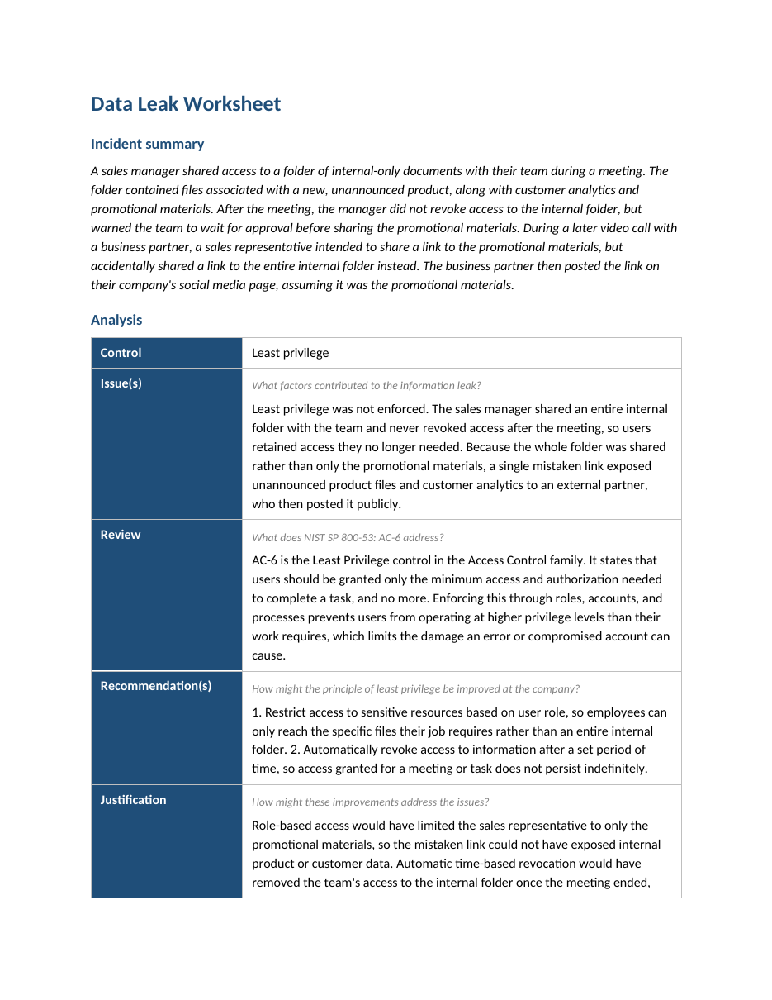

# Data leak and least privilege (NIST SP 800-53 AC-6)

An analysis of a data-leak incident caused by over-broad access, mapped to the
least privilege control and turned into two concrete access-control improvements.
Working from the incident summary, I identified what failed, reviewed the relevant
NIST SP 800-53 control (AC-6), and recommended changes that would prevent a repeat.

## 📖 Context

A sales manager shared access to a folder of internal-only documents with their
team during a meeting. The folder held files for a new, unannounced product,
customer analytics, and promotional materials. After the meeting the manager did
not revoke access, but warned the team to wait for approval before sharing the
promotional materials. On a later video call with a business partner, a sales
representative meant to share a link to the promotional materials but shared a link
to the entire internal folder instead. The business partner, assuming it was the
promotional materials, then posted the link on their company's social media page.
My task was to analyse the leak against the principle of least privilege and
recommend improvements.

## ⚙️ Action

I worked the analysis as a control review: name what failed, tie it to the formal
control, then recommend changes that close the gap.

- **Identified the contributing factors:** least privilege was not enforced. The
  manager shared an entire internal folder rather than only the promotional
  materials, and never revoked access after the meeting, so the team retained
  access it no longer needed. Because the whole folder was shared, a single
  mistaken link exposed unannounced product files and customer analytics to an
  external partner.
- **Reviewed the control:** NIST SP 800-53 **AC-6 (Least Privilege)** in the Access
  Control family. It requires that users be granted only the minimum access and
  authorisation needed to complete a task, enforced through roles, accounts, and
  processes, so no one operates at a higher privilege level than their work
  requires. That containment is exactly what limits the damage an error or a
  compromised account can cause.
- **Mapped fixes to the failures:** each recommendation targets one of the two
  failures, over-broad scope and access that never expires.

| Failure | AC-6 improvement |
|---|---|
| Whole internal folder shared, not just the needed files | Role-based access to sensitive resources |
| Access never revoked after the meeting | Automatic time-based revocation |

## ✅ Result

The deliverable is a completed least-privilege analysis with two recommendations
and the justification for each.

1. **Restrict access to sensitive resources by role**, so employees can reach only
   the specific files their job requires rather than an entire internal folder.
2. **Automatically revoke access after a set period**, so access granted for a
   meeting or task does not persist indefinitely.

Together they enforce least privilege from both directions. Role-based access would
have limited the sales representative to the promotional materials alone, so the
mistaken link could not have exposed internal product or customer data. Automatic
time-based revocation would have removed the team's access to the internal folder
once the meeting ended, closing the window in which the accidental share was even
possible.

_Full deliverable: [Data Leak Worksheet (PDF)](./data-leak-worksheet.pdf)_

## 🧠 What this demonstrates

This lab is foundational security work: transferable fundamentals that support the
application security and DevSecOps direction described in the root README, not
expert-level practice. It shows working familiarity with NIST SP 800-53 and the
AC-6 least privilege control, the ability to trace a data leak back to an
access-control failure rather than stopping at the accidental share, and the
judgement to recommend fixes that address both the scope of access and its
lifetime. Least privilege and role-based, time-bound access are core to the
identity and access work the root README builds toward, applied here to a concrete
leak.

## 📂 Source materials

**Scenario and attribution**

The data-leak scenario and the worksheet structure are adapted from the Google
Cybersecurity Certificate (Coursera). The analysis, the AC-6 mapping, the
recommendations, and the write-up documented in this lab are my own work.

The supporting document lives in [`source/`](./source/):

- **data-leak-worksheet.docx:** editable source of the completed worksheet.
