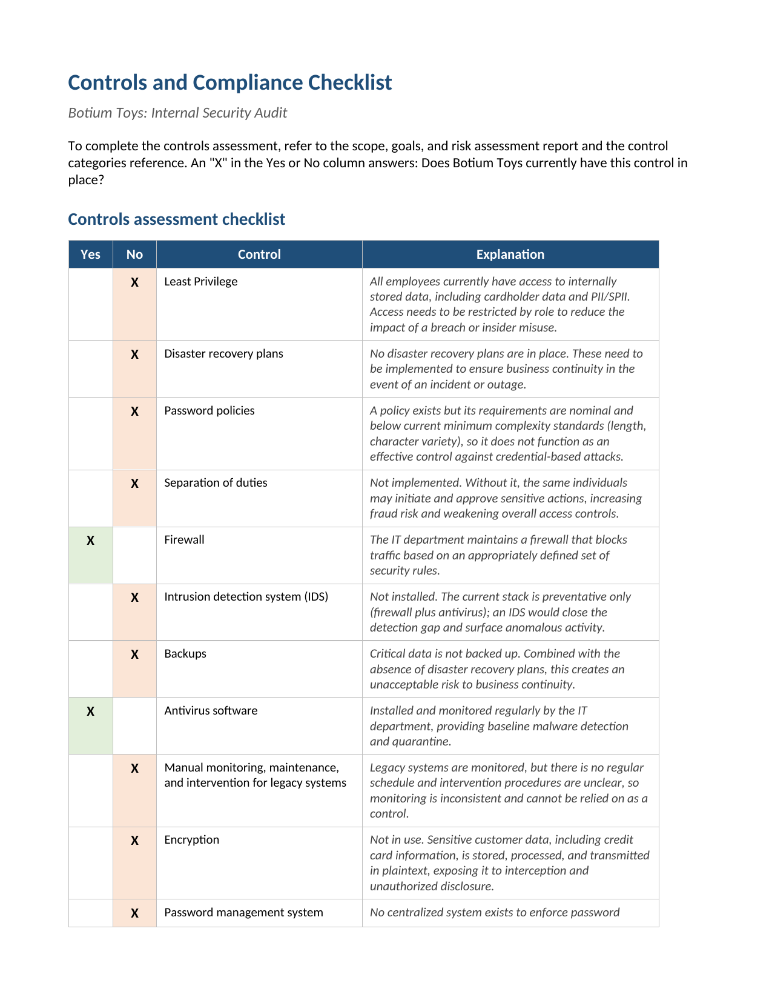

# Internal Security Audit: Botium Toys

A NIST CSF-based internal security audit of Botium Toys, a fictional U.S. toy
company expanding its online presence into the E.U. The audit assesses the
company's controls and compliance posture against PCI DSS, GDPR, and SOC 1/2,
then turns the findings into a prioritised remediation roadmap.

## 📖 Context

Botium Toys is growing its online store and preparing to sell into the E.U.
Ahead of that expansion, the IT manager initiated an internal audit to identify
control gaps, regulatory exposure, and remediation priorities before
non-compliance turns into fines or a business continuity incident. The audit
scope covers the entire security program: all assets, processes, and controls,
not a single system or department. I worked from the IT manager's risk
assessment report and a control categories reference, mapping a narrative
account of the environment onto a structured controls and compliance checklist.

## ⚙️ Action

I worked the audit in two passes.

- **First pass:** I read the IT manager's scope, goals, and risk assessment
  report and indexed each statement about the environment against a named
  control in the control categories reference, so every later answer traced
  back to specific evidence rather than assumption.
- **Second pass:** I answered each checklist item directly from that evidence,
  marking a control in place only where it was both present and adequate. Where
  a control was absent, or present but too weak to function as a control, for
  example a nominal password policy with no enforcement mechanism, I marked it
  not in place and carried the gap into the recommendations.

The frameworks referenced throughout were NIST CSF for the overall structure,
and PCI DSS, GDPR, and SOC 1/2 for the compliance assessment.

| Area | In place | Gaps |
|---|---|---|
| Controls assessment | 5 / 14 | Least privilege, separation of duties, password policies, disaster recovery, backups, IDS, encryption, password management system, legacy systems maintenance |
| PCI DSS | 0 / 4 | All four best practices not met |
| GDPR | 2 / 4 | E.U. data not secured; data not classified/inventoried |
| SOC 1/2 | 1 / 4 | User access policies, PII/SPII confidentiality, authorization-bounded availability |

## ✅ Result

The deliverable is a completed controls and compliance checklist paired with a
prioritised remediation roadmap. Five of fourteen controls are in place and
nine are missing. On compliance, all four PCI DSS best practices fail, GDPR
sits at two of four, and SOC 1/2 sits at one of four.

The recommendations are ordered by regulatory exposure first and operational
resilience second. Encryption leads because it is the one gap that cuts across
PCI DSS, GDPR, and SOC obligations at the same time, so closing it reduces
exposure on three fronts at once.

_Full deliverable: [Controls and Compliance Checklist (PDF)](./botium-toys-controls-compliance-checklist.pdf)_

The seven recommendations, in priority order:

1. **Encryption** for credit card data and all PII/SPII, in transit and at rest.
2. **Least privilege and separation of duties**, replacing blanket access to all internally stored data.
3. **Password management system**, with a strengthened policy the IT department can actually enforce.
4. **Disaster recovery plans and routine backups** of critical data.
5. **Intrusion detection system (IDS)** to add detection to the existing preventative firewall and antivirus stack.
6. **Asset identification and classification**, the Identify function that NIST CSF starts from.
7. **Legacy system maintenance schedule**, giving the existing monitoring a defined cadence and intervention method.

## 🧠 What this demonstrates

This lab is foundational security work: transferable fundamentals that support the application security and DevSecOps direction described in the root README, not expert-level practice. It
shows the ability to read a narrative risk assessment and map it onto a control
framework, working familiarity with NIST CSF, PCI DSS, GDPR, and SOC 1/2, and
the judgement to prioritise remediation by regulatory exposure rather than by
the order items happen to appear on a checklist.

## 📂 Source materials

**Scenario and attribution**

The Botium Toys scenario, the IT manager's risk assessment narrative, and the
control categories reference are adapted from the Google Cybersecurity
Certificate, Module 2: Play It Safe, Manage Security Risks (Coursera). The audit
methodology, control mapping, compliance analysis, prioritisation logic, and
remediation recommendations documented in this lab are my own work.

The supporting documents live in [`source/`](./source/):

- **botium-toys-controls-compliance-checklist.docx:** editable source of the completed checklist deliverable.
- **scope-goals-and-risk-assessment-report.pdf:** the IT manager's narrative risk assessment, the primary evidence for the controls answers.
- **control-categories.pdf:** reference describing each control's type and purpose.
