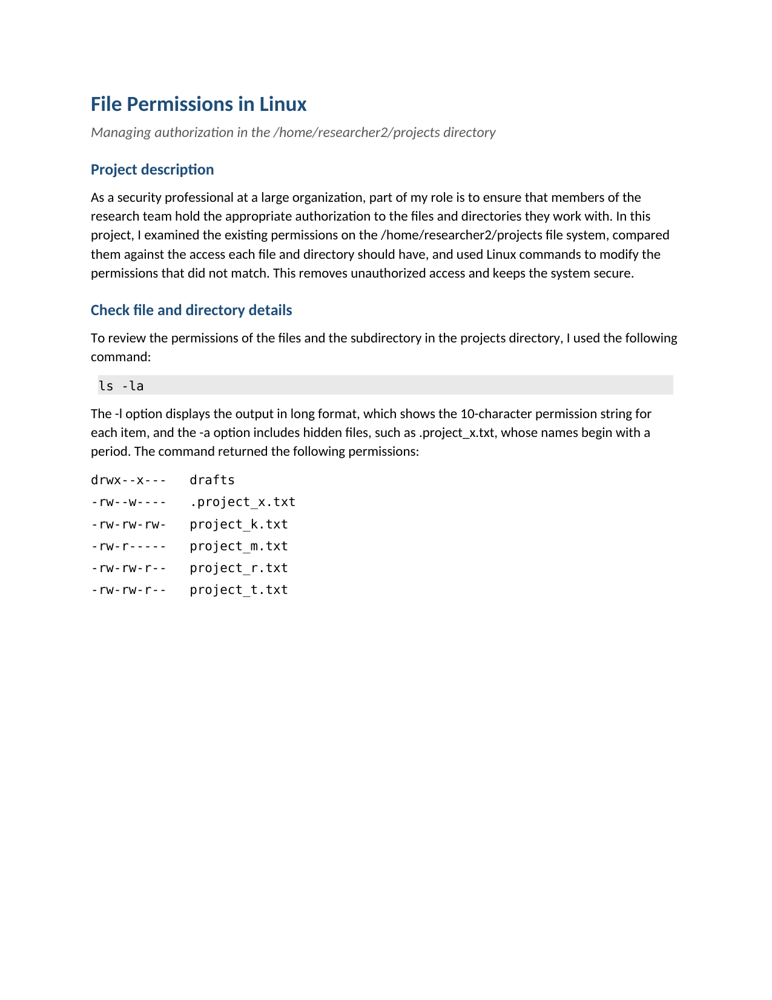

# Linux Security: File Permissions & Authorization Management

A Linux authorization audit of the `/home/researcher2/projects` directory. Working
from the existing permissions on the file system, I identified which files and
directories were misconfigured against the organization's access requirements and
used `chmod` to correct each one.

## 📖 Context

As a security professional at a large organization, part of the role is to ensure
that members of the research team hold the appropriate authorization to the files
and directories they work with. The organization had an existing set of permissions
on the `/home/researcher2/projects` directory that did not fully match the intended
access policy. My task was to examine those permissions, identify the gaps, and
apply the corrections using Linux commands.

## ⚙️ Action

I worked the audit in two steps: inspect the current state, then correct each
mismatch.

**Inspect:** I used `ls -la` to list the permissions of all files and the
subdirectory, including hidden files (the `-a` flag surfaces files whose names
begin with a period, such as `.project_x.txt`, which `ls -l` alone does not show).
The command returned the following permission state:

```text
drwx--x---  drafts
-rw--w----  .project_x.txt
-rw-rw-rw-  project_k.txt
-rw-r-----  project_m.txt
-rw-rw-r--  project_r.txt
-rw-rw-r--  project_t.txt
```

Reading the 10-character permission string: the first character is the file type
(`-` for a regular file, `d` for a directory); the next three are user (owner)
permissions; the following three are group permissions; the final three are
permissions for other (all other users). Each position holds `r` (read), `w`
(write), `x` (execute), or `-` (not granted).

**Correct — three changes were needed:**

- **Remove write access for other on `project_k.txt`:** the organization does not
  allow other users to have write access to any file. `project_k.txt` was the only
  file granting it (`-rw-rw-rw-`). I removed it with `chmod o-w project_k.txt`,
  updating the permissions to `-rw-rw-r--`.

- **Restrict the hidden file `.project_x.txt` to read-only:** this archived file
  should not have write permissions for anyone, but user and group should still be
  able to read it. Its permissions were `-rw--w----` — the user had read and write,
  the group had write only. I set both to read-only in a single command:
  `chmod u=r,g=r .project_x.txt`, which uses `=` to replace whatever was there
  before rather than adding or removing individual bits. Result: `-r--r-----`.

- **Remove group execute access on the `drafts` directory:** only `researcher2`
  should be able to enter this subdirectory. The directory's permissions were
  `drwx--x---`, which allowed the group to execute (enter) it. I removed that with
  `chmod g-x drafts`, giving `drwx------` so only the owner retains access.

| Item             | Before       | Command                        | After        |
| ---------------- | ------------ | ------------------------------ | ------------ |
| `project_k.txt`  | `-rw-rw-rw-` | `chmod o-w project_k.txt`      | `-rw-rw-r--` |
| `.project_x.txt` | `-rw--w----` | `chmod u=r,g=r .project_x.txt` | `-r--r-----` |
| `drafts/`        | `drwx--x---` | `chmod g-x drafts`             | `drwx------` |

## ✅ Result

After applying the three `chmod` commands, the `/home/researcher2/projects` file
system grants only the intended level of access to each user: no file gives write
access to other, the archived hidden file is readable only by the owner and group,
and the `drafts` subdirectory is accessible to `researcher2` alone. The corrections were
confirmed in each case by running `ls -la` after the change to verify the updated
permission string.

[](./file-permissions-in-linux.pdf)

_Full deliverable: [File Permissions in Linux (PDF)](./file-permissions-in-linux.pdf)_

## 🧠 What this demonstrates

This lab is foundational security work: transferable fundamentals that support the application security and DevSecOps direction described in the root README, not expert-level practice. It shows working
knowledge of the Linux permission model (user/group/other, read/write/execute, the
10-character permission string), practical proficiency with `ls -la` and `chmod`
for auditing and correcting file system access, and the judgement to read an
existing permission state against a policy and identify exactly what needs to
change — including hidden files that a standard `ls` would not surface. Controlling
file system authorization is a core part of the principle of least privilege, and
this lab applies it at the command line in the way a security team would. It also
builds on Linux commands I use day to day as a software developer, such as `ls`
and `mv`, extended here from everyday navigation and file operations to auditing
and correcting file-system permissions.

## 📂 Source materials

**Scenario and attribution**

The scenario and the file system environment are adapted from the Google
Cybersecurity Certificate (Coursera). The permission audit, the command choices,
and the write-up documented in this lab are my own work.

The supporting documents live in [`source/`](./source/):

- **file-permissions-in-linux.docx:** editable source of the completed deliverable.
- **current-file-permissions.pdf:** the initial permission state of the file system, used as the audit baseline.
- **file-permissions-in-linux-guide.pdf:** course reference guide for the lab, used as background.
