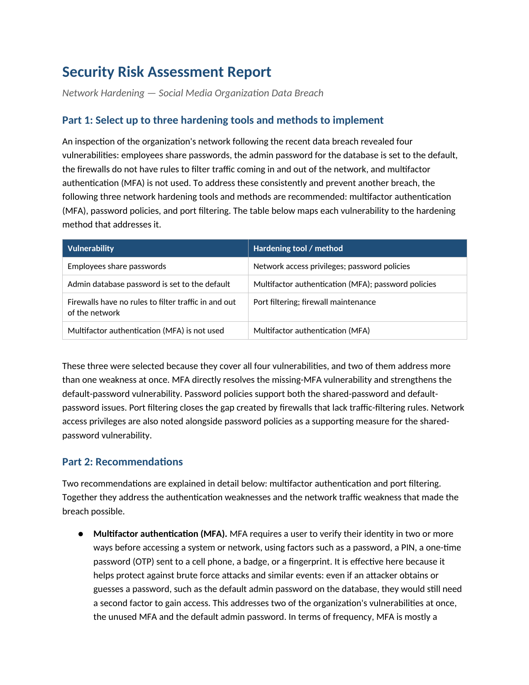

# Security Risk Assessment: Network Hardening

A post-breach network hardening assessment for a social media organization. Working
from a network inspection that surfaced four vulnerabilities, I selected a set of
hardening tools and methods that cover every gap and documented the choice — with
two recommendations explained in detail — as a structured security risk assessment.

## 📖 Context

Following a data breach, an inspection of the organization's network revealed four
vulnerabilities: employees share passwords, the database admin password is still
set to the default, the firewalls have no rules to filter traffic in and out of the
network, and multifactor authentication (MFA) is not used. My task was to select up
to three hardening tools and methods that address these weaknesses, justify the
selection, and explain two of the recommendations in detail so the organization can
prevent another breach.

## ⚙️ Action

I mapped each vulnerability to the hardening method that addresses it, then chose
the smallest set of methods that still covers all four gaps.

- **Mapped vulnerabilities to controls:** rather than pick tools in isolation, I
  paired each weakness with a specific hardening method, which made the overlaps
  visible and kept the selection evidence-driven.
- **Selected for coverage:** MFA, password policies, and port filtering together
  cover all four vulnerabilities, and two of them address more than one weakness at
  once — MFA resolves the missing-MFA gap and strengthens the default-password gap,
  while password policies support both the shared-password and default-password
  issues. Network access privileges are noted as a supporting measure for shared
  passwords.
- **Prioritised the write-up:** I explained MFA and port filtering in detail
  because together they close the authentication weaknesses and the network-traffic
  weakness that made the breach possible.

| Vulnerability | Hardening tool / method |
|---|---|
| Employees share passwords | Network access privileges; password policies |
| Admin database password set to default | Multifactor authentication (MFA); password policies |
| Firewalls have no traffic-filtering rules | Port filtering; firewall maintenance |
| Multifactor authentication not used | Multifactor authentication (MFA) |

## ✅ Result

The deliverable is a completed security risk assessment recommending three
hardening methods — MFA, password policies, and port filtering — chosen because
they cover all four vulnerabilities with the least overlap. Two are explained in
depth:

- **Multifactor authentication (MFA):** requires a second proof of identity
  (OTP, badge, fingerprint, PIN) beyond the password, so even a guessed or stolen
  credential — such as the default admin password — is not enough to gain access.
  It closes two vulnerabilities at once and, being set up once and then maintained,
  is high value for the effort.
- **Port filtering:** a firewall function that allows only the ports the
  organization needs and blocks the rest, controlling traffic and shrinking the
  attack surface. It directly addresses the unfiltered-firewall gap and is paired
  with regular firewall maintenance so the rules stay current as the network
  changes.

_Full deliverable: [Security Risk Assessment (PDF)](./security-risk-assessment-network-hardening.pdf)_

## 🧠 What this demonstrates

This lab is foundational analyst work, consistent with the SOC analyst
trajectory described in the root README rather than expert-level practice. It
shows the ability to translate a list of network vulnerabilities into a
proportionate set of hardening controls, working familiarity with MFA, password
policies, port filtering, and firewall maintenance, and the judgement to choose
controls by coverage — picking methods that resolve more than one weakness at once
rather than one tool per finding. It also shows the ability to justify a security
recommendation in the assessment format a team would actually act on.

## 📂 Source materials

**Scenario and attribution**

The scenario, the network inspection findings, and the report template are adapted
from the Google Cybersecurity Certificate, Module 3: Connect and Protect, Networks
and Network Security (Coursera). The vulnerability-to-control mapping, the
selection rationale, and the recommendations documented in this lab are my own work.

The supporting documents live in [`source/`](./source/):

- **security-risk-assessment-network-hardening.docx:** editable source of the completed assessment deliverable.
- **security-risk-assessment-report-template.docx:** the blank report template the write-up was structured against.
- **network-hardening-tools-sheet.pdf:** reference describing the available network hardening tools and methods.