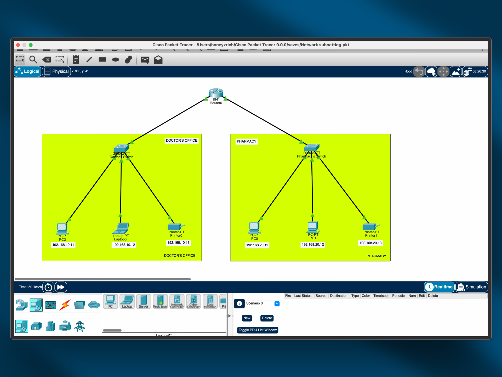
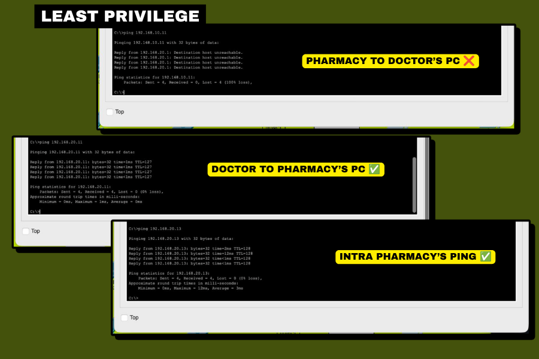
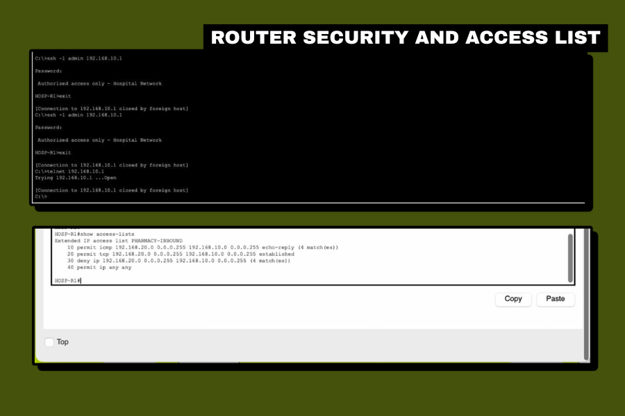
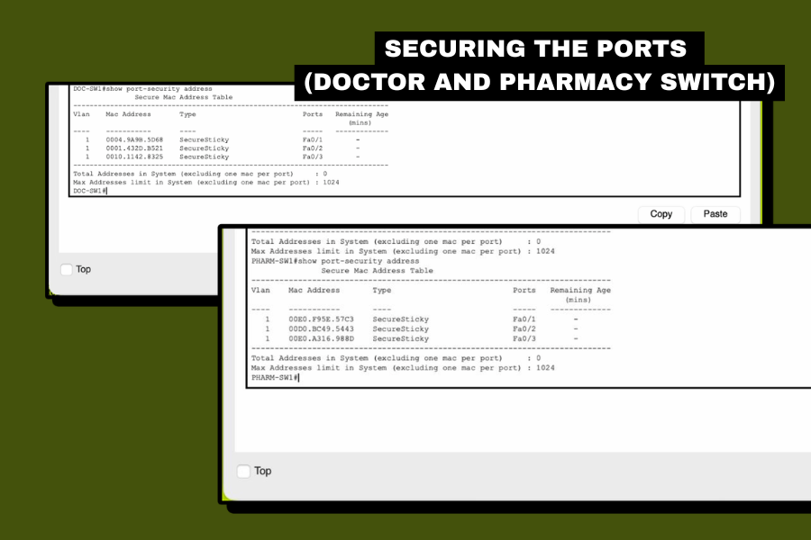

# Network segmentation and least privilege (hospital network)

A hands-on Cisco Packet Tracer build of a two-department hospital network, taken
past the connectivity brief and hardened into a least-privilege design. The
assignment asked only that every device reach every other device. In a hospital,
flat reachability between the pharmacy and the machines holding patient records is
a finding, not a feature, so after meeting the brief I segmented the two
departments and enforced who is allowed to start a conversation with whom.

## 📖 Context

A small hospital moved into a new building with two departments, the Doctor's
Office (a laptop, a PC, and a printer) and the Pharmacy (two PCs and a printer).
Each department needed full connectivity within itself, and the two needed to
communicate so doctors could send prescriptions electronically and pull patient
records across departments. The brief, given as a Network Technician task, was to
design and configure a network where each department has its own LAN behind a
switch, both LANs connect to a single router on separate interfaces, and all
devices can ping each other.

Meeting that brief literally produces a flat network: any pharmacy machine can
reach any patient-record machine in the Doctor's Office. That is the gap this lab
sets out to close without breaking the legitimate prescription workflow.

## ⚙️ Action

I built the network to the brief first, verified full connectivity, then applied a
security layer in three parts. The addressing keeps each department on its own /24
so the router is the single point where cross-department traffic can be inspected
and controlled.

| Segment | Network | Router interface |
|---|---|---|
| Doctor's Office | 192.168.10.0/24 | HOSP-R1 g0/0 → 192.168.10.1 |
| Pharmacy | 192.168.20.0/24 | HOSP-R1 g0/1 → 192.168.20.1 |

- **Segmentation as the foundation:** two separate LANs, each on its own switch and
  its own subnet, joined only through the router. Keeping the departments in
  distinct broadcast domains is what makes a boundary control possible at all;
  everything below depends on the router being the only path between them.
- **Directional least privilege with a router ACL.** The real need is
  one-directional: doctors initiate connections to the pharmacy to send
  prescriptions; the pharmacy has no business reason to reach into patient-record
  hosts. I wrote a named extended ACL, `PHARMACY-INBOUND`, applied inbound on the
  pharmacy-facing interface (g0/1), that permits the pharmacy to send replies to
  doctor-initiated traffic (`icmp echo-reply`, `tcp established`) but denies it from
  initiating any new session into the Doctor's LAN, while leaving pharmacy access
  to everything else intact.
- **Switch port security.** On both switches the three device ports run in access
  mode with `port-security`, a maximum of one MAC address, sticky learning, and a
  `shutdown` violation action, so each port binds to the device present when it was
  configured and err-disables if a different device is swapped in. All unused ports
  (fa0/4–24) are administratively shut, since a switch defaults every port to on and
  an idle live jack is an open door.
- **Hardened management plane.** The router runs an `enable secret`, encrypted
  service passwords, a login banner, and SSH-only remote administration
  (`transport input ssh` with a local user account), so management traffic is
  encrypted and unauthenticated Telnet is refused.

The ACL is intentionally a stateless approximation of stateful filtering: `tcp
established` and `icmp echo-reply` inspect flags and message type, not real
connection state, so a crafted packet matching those criteria would pass. That is a
known limitation of ACL-based return-traffic handling, not a substitute for a
stateful firewall, and it is the honest ceiling of what this control provides.

## ✅ Result

The network meets the brief and enforces the intended asymmetry, verified from the
end devices and confirmed at the router.

- **Doctor's Office → Pharmacy** reaches its target (0% loss). The prescription
  workflow the hospital actually needs is preserved.
- **Pharmacy → Doctor's Office** is refused: the pharmacy gateway returns ICMP
  destination-unreachable and the ping records 100% loss, because the router drops
  the packet at the boundary under the deny rule.
- **Pharmacy → Pharmacy** still succeeds, proving the control is surgical rather
  than a blanket block: intra-department traffic is untouched.

The router confirms the mechanism behind that behaviour. `show access-lists` shows
the `permit ... echo-reply` line and the `deny ip 192.168.20.0 ... 192.168.10.0`
line both incrementing, so the block is not inferred from a failed ping but counted
on the exact traffic it was written to stop.

At the switch layer, port security is enabled and secure on the device ports, with
each port bound to a learned sticky MAC address.

## 🧠 What this demonstrates

This lab is foundational, hands-on network security rather than expert practice, but
it shows the instinct the application security and DevSecOps direction in the root
README is built on: a brief was satisfied, then read critically for the risk it left
behind, and hardened. Concretely it demonstrates least privilege applied at the
network layer, the principle from NIST SP 800-53 **AC-6** expressed here as boundary
protection (**SC-7**) and information-flow enforcement (**AC-4**) through a
directional ACL; least functionality (**CM-7**) by disabling unused switch ports;
and secure management via SSH-only administration. It also shows the judgement to
name a control's limitation out loud, treating the stateless ACL as an
approximation of stateful filtering rather than overstating it. The least-privilege
and segmentation thinking here is the network-layer counterpart to the
access-control work in the [Data Leak & Least Privilege](../data-leak-least-privilege/analysis.md)
lab and the paper hardening controls in the [Network Hardening Assessment](../network-hardening-assessment/analysis.md).

## 📂 Source materials

**Scenario and attribution**

The hospital scenario is a practice task from the TS Academy #30DaysOfTech
challenge, which asked only for a connected two-department network. The
segmentation design, the ACL, the port-security and management-plane hardening, the
verification, and this write-up are my own work and go beyond the original brief.

The deliverable is the Cisco Packet Tracer simulation
([`hospital-network.pkt`](./hospital-network.pkt)) and the verification screenshots
in this folder. A short simulation walkthrough of packets traversing the two
departments accompanies the LinkedIn post for the challenge.
