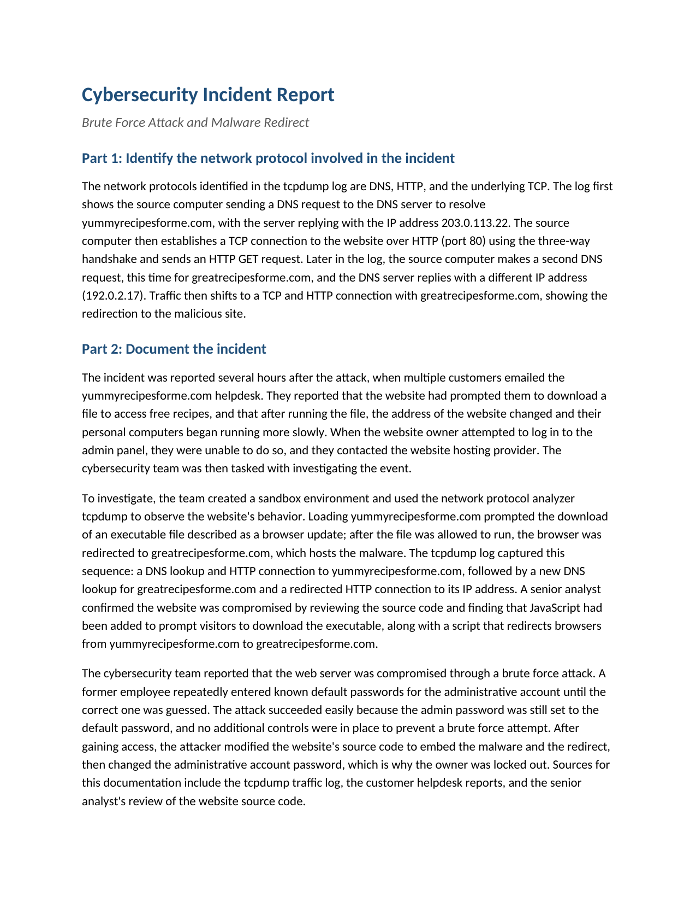

# Network Traffic Analysis: Brute Force Attack & Malware Redirect

A tcpdump investigation of a compromised website. Working from a captured DNS and
HTTP traffic log, customer helpdesk reports, and a source-code review, I traced a
malware redirect back to a brute force compromise of the site's admin account and
documented the finding as a structured incident report.

## 📖 Context

Several hours after the attack, customers emailed the yummyrecipesforme.com
helpdesk: the site had prompted them to download a file to access free recipes,
and after running it their browsers were redirected to a different address and
their computers slowed down. When the website owner tried to log in to the admin
panel, they were locked out and contacted the hosting provider. The cybersecurity
team was tasked with investigating. My task was to analyse the captured traffic,
identify the protocols and the sequence of events, and document the incident and
a remediation in the standard report format.

## ⚙️ Action

I read the tcpdump log as paired DNS-resolution and TCP/HTTP events, and combined
it with the helpdesk reports and the senior analyst's source-code review to
separate what the traffic showed from what caused it.

- **Identified the protocols and baseline:** the log shows DNS, HTTP, and the
  underlying TCP. The source machine resolves yummyrecipesforme.com to
  203.0.113.22, completes a TCP three-way handshake, and sends an HTTP GET over
  port 80 — a normal page load.
- **Traced the redirect in the capture:** later the source machine issues a
  second DNS request, this time for greatrecipesforme.com, which resolves to a
  different IP (192.0.2.17). Traffic then shifts to a new TCP/HTTP connection with
  that host — the redirection to the malicious site, visible in the packets.
- **Confirmed the mechanism:** reproduced in a sandbox, loading the site prompted
  the download of an executable described as a browser update; running it
  redirected the browser to greatrecipesforme.com, which hosts the malware. A
  senior analyst's review of the site's source code found injected JavaScript that
  prompted the download and a script that performed the redirect.
- **Established the root cause:** the web server was compromised through a brute
  force attack — a former employee repeatedly entered known default passwords for
  the administrative account until one worked. It succeeded because the admin
  password was still the default and nothing throttled repeated attempts. After
  gaining access, the attacker modified the source code to embed the malware and
  redirect, then changed the admin password, which is why the owner was locked out.

| Field | Observation |
|---|---|
| Protocols | DNS for resolution; TCP + HTTP (port 80) for connections |
| Legitimate site / IP | yummyrecipesforme.com → 203.0.113.22 |
| Malicious site / IP | greatrecipesforme.com → 192.0.2.17 |
| Delivery | Executable posing as a "browser update", then a scripted redirect |
| Root cause | Brute force of the admin account (unchanged default password) |
| Sources | tcpdump log, customer helpdesk reports, source-code review |

## ✅ Result

The completed report identifies a brute force compromise with a malware redirect:
the attacker guessed the default admin password, injected code that pushed a
malicious "browser update" and redirected visitors to greatrecipesforme.com, then
changed the password to lock out the owner. The report's recommended remediation
is to enforce **two-factor / multi-factor authentication** on the admin account
and all privileged logins, so a guessed password alone can no longer grant access.
It pairs 2FA with supporting controls: replacing the default password and
enforcing a strong password policy, limiting failed attempts with account lockout
or throttling, and monitoring and logging login attempts so repeated failures from
one source are detected early.

_Full deliverable: [Cybersecurity Incident Report (PDF)](./cybersecurity-incident-report-brute-force-attack.pdf)_

## 🧠 What this demonstrates

This lab is foundational security work: transferable fundamentals that support the application security and DevSecOps direction described in the root README, not expert-level practice. It
shows the ability to read a tcpdump DNS and HTTP capture as a chronological
sequence of connections, working knowledge of DNS resolution, the TCP three-way
handshake, and HTTP over port 80, and the judgement to correlate network evidence
with helpdesk reports and a source-code review to move from the observable symptom
(the redirect) to the root cause (a brute force login). It also shows the ability
to translate that finding into a proportionate remediation — MFA backed by
password policy, lockout, and monitoring — in the incident report format a team
would actually circulate.

## 📂 Source materials

The supporting documents live in [`source/`](./source/):

- **cybersecurity-incident-report-brute-force-attack.docx:** editable source of the completed report.
- **security-incident-report-template.docx:** the blank report template the write-up was structured against.
- **tcpdump-traffic-log.pdf:** the tcpdump DNS and HTTP traffic capture analysed in this lab.
- **how-to-read-the-tcpdump-traffic-log.pdf:** a reference guide for interpreting the log format, used only as background.

**Scenario and attribution**

The scenario, the tcpdump traffic log, the reference guide, and the report
template are adapted from the Google Cybersecurity Certificate, Module 3: Connect
and Protect, Networks and Network Security (Coursera). The traffic analysis, the
finding, and the incident report documented in this lab are my own work.