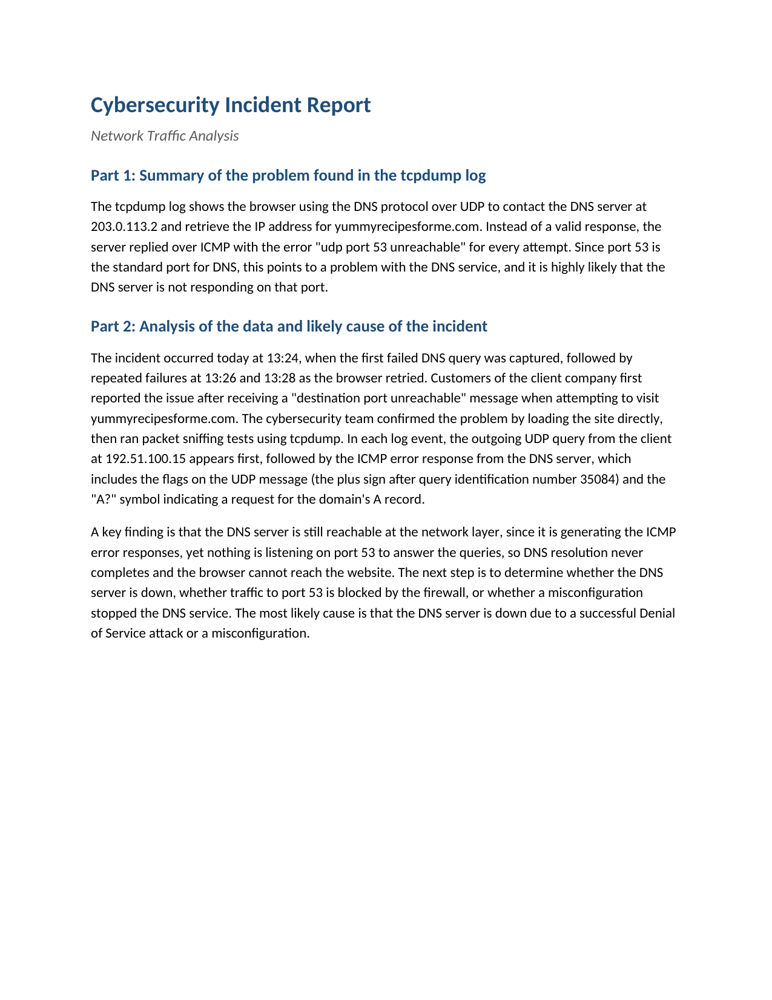

# Network Traffic Analysis: DNS and ICMP Incident

A packet-level investigation of a website outage. Working from a tcpdump capture
of DNS and ICMP traffic, I traced why customers of a client company could no
longer reach yummyrecipesforme.com and documented the finding as a structured
incident report.

## 📖 Context

Customers of the client company reported that the website
yummyrecipesforme.com would not load, and that they received a "destination
port unreachable" message when they tried. The cybersecurity team reproduced the
fault, then captured the traffic with tcpdump so the failure could be traced at
the packet level rather than guessed at from the symptom. My task was to read
that capture, identify the point of failure, and write it up in the standard
incident report format.

## ⚙️ Action

I read the tcpdump log as a request and response sequence rather than a flat
list of packets, following each DNS query to whatever came back.

- **Traced the DNS query:** each event begins with an outgoing UDP query from
  the client at 192.51.100.15 to the DNS server at 203.0.113.2, asking for the A
  record of yummyrecipesforme.com. The query identification number 35084 and the
  "A?" marker confirm it as a standard forward-resolution request.
- **Read the response:** instead of an address, the server answered over ICMP
  with "udp port 53 unreachable" on every attempt, captured at 13:24 and again
  on the retries at 13:26 and 13:28. Port 53 is the standard port for DNS.
- **Separated network reachability from service availability:** the server was
  still reachable at the network layer, since it was the source of the ICMP
  errors, yet nothing was listening on port 53 to answer the queries. That
  distinction is the core of the finding.

I mapped each answer back to a specific packet in the capture rather than to the
general symptom, and structured the write-up against the provided report
template, using the worked example only for the expected format.

| Field | Observation from the capture |
|---|---|
| Protocols | DNS over UDP for the query; ICMP for the error response |
| Client / DNS server | 192.51.100.15 querying 203.0.113.2 |
| Port in the error | 53, the standard DNS port |
| ICMP message | "udp port 53 unreachable", repeated on every retry |
| Timeline | First failure 13:24, retries 13:26 and 13:28 |

## ✅ Result

The completed report identifies a DNS resolution failure: the DNS server is
reachable on the network but is not answering on port 53, so name resolution
never completes and the browser cannot load the site. The most likely cause is
that the DNS service is down, whether from a successful denial-of-service attack
or a misconfiguration, and the report names the next diagnostic steps:
confirming whether the service is running, whether the firewall is blocking port
53, and whether a configuration change stopped the service.

_Full deliverable: [Cybersecurity Incident Report (PDF)](./cybersecurity-incident-report-network-traffic-analysis.pdf)_

## 🧠 What this demonstrates

This lab is foundational security work: transferable fundamentals that support the application security and DevSecOps direction described in the root README, not expert-level practice. It
shows the ability to read a tcpdump capture as a conversation between hosts,
working knowledge of the DNS, UDP, and ICMP protocols and the role of port 53,
and the judgement to separate a reachable host from an unavailable service,
which points the investigation at the DNS daemon rather than at the network
path. It also shows the ability to record a technical finding in the incident
report format a team would actually circulate.

## 📂 Source materials

The supporting documents live in [`source/`](./source/):

- **cybersecurity-incident-report-network-traffic-analysis.docx:** editable source of the completed report.
- **cybersecurity-incident-report-template.docx:** the blank report template the write-up was structured against, kept as an editable document.
- **example-cybersecurity-incident-report.pdf:** a worked example for a different scenario, used only as a format reference.

**Scenario and attribution**

The scenario, the tcpdump capture, the report template, and the worked example
are adapted from the Google Cybersecurity Certificate, Module 3: Connect and
Protect, Networks and Network Security (Coursera). The packet analysis, the
finding, and the incident report documented in this lab are my own work.
