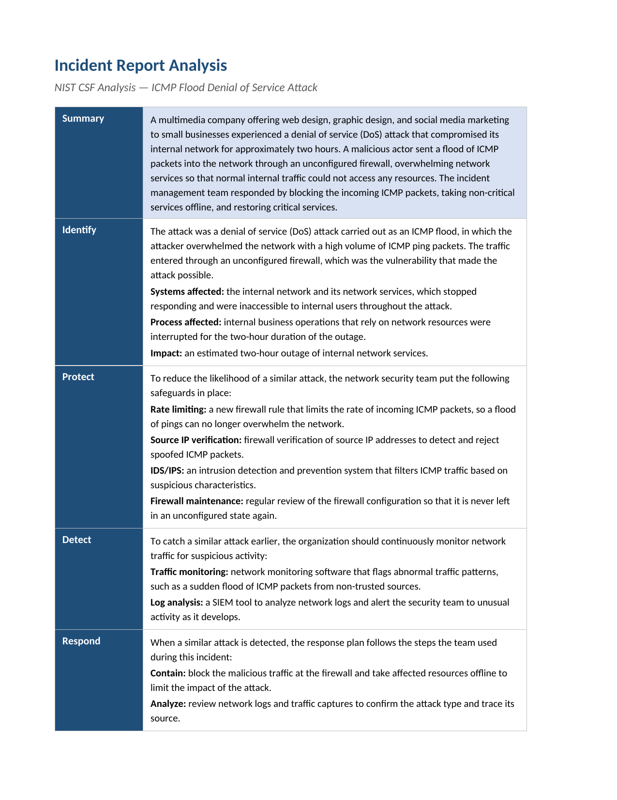

# Incident Report Analysis: ICMP Flood DoS (NIST CSF)

An incident report analysis of a denial-of-service attack, structured through the
five functions of the NIST Cybersecurity Framework. Working from an ICMP flood that
took a multimedia company's internal network offline, I scoped the incident and
mapped it onto Identify, Protect, Detect, Respond, and Recover as a single
structured report.

## 📖 Context

A multimedia company offering web design, graphic design, and social media
marketing to small businesses suffered a denial-of-service (DoS) attack that
compromised its internal network for roughly two hours. A malicious actor flooded
the network with ICMP ping packets through an unconfigured firewall, overwhelming
network services so internal users could not reach any resources. The incident
management team contained it by blocking the incoming ICMP packets, taking
non-critical services offline, and restoring critical services. My task was to
document the incident as a structured analysis using the NIST CSF.

## ⚙️ Action

I ran the incident through the five NIST CSF functions so a single event feeds a
broader security strategy, rather than treating it as a one-off outage.

- **Identify:** classified the attack as an ICMP flood DoS and named the root
  cause — an unconfigured firewall that gave the flood a direct path in. Scoped the
  affected systems (the internal network and its services), the affected process
  (internal operations dependent on network resources), and the impact (an
  estimated two-hour outage).
- **Protect:** specified safeguards that reduce the likelihood of a repeat — ICMP
  rate limiting, source IP verification to reject spoofed packets, an IDS/IPS to
  filter ICMP by suspicious characteristics, and regular firewall maintenance so it
  is never left unconfigured again.
- **Detect:** added traffic monitoring to flag abnormal patterns such as a sudden
  ICMP flood from non-trusted sources, and SIEM-based log analysis to alert the
  team as unusual activity develops.
- **Respond:** captured the response plan the team used — contain the malicious
  traffic at the firewall and take affected resources offline, analyse logs and
  captures to confirm the attack type and source, then communicate to staff and
  users and update procedures.
- **Recover:** restore critical services first and then non-critical ones once the
  network is stable, and improve the recovery process to shorten the two-hour
  recovery window in future.

| NIST CSF function | Applied to this incident |
|---|---|
| Identify | ICMP flood DoS via an unconfigured firewall; internal network + services, ~2-hour outage |
| Protect | Rate limiting, source IP verification, IDS/IPS, firewall maintenance |
| Detect | Traffic monitoring for abnormal patterns; SIEM log analysis |
| Respond | Contain at the firewall, analyse logs/captures, communicate and improve |
| Recover | Restore critical then non-critical services; refine recovery time |

## ✅ Result

The deliverable is a completed incident report analysis that traces the ICMP flood
from root cause to recovery across all five NIST CSF functions. The central finding
is that the incident was preventable: the firewall was left unconfigured, and basic
firewall hardening — rate limiting, source IP verification, and filtering ICMP by
suspicious characteristics — would likely have stopped the outage entirely. Framing
the event through NIST CSF shows how one incident strengthens the wider program:
Identify scopes what was hit, Protect and Detect lower the odds and raise the
visibility of a repeat, and Respond and Recover shorten the impact if it recurs.

_Full deliverable: [Incident Report Analysis (PDF)](./incident-report-analysis-nist-csf.pdf)_

## 🧠 What this demonstrates

This lab is foundational security work: transferable fundamentals that support the application security and DevSecOps direction described in the root README, not expert-level practice. It
shows working familiarity with the NIST Cybersecurity Framework and the ability to
apply its five functions to a concrete incident, knowledge of ICMP flood DoS
mechanics and the firewall controls that mitigate them (rate limiting, source IP
verification, IDS/IPS), and the judgement to trace an outage back to a preventable
misconfiguration rather than stopping at the symptom. It also shows the ability to
turn a single event into forward-looking Protect, Detect, Respond, and Recover
actions in the structured report format a team would actually use.

## 📂 Source materials

**Scenario and attribution**

The scenario, the incident report template, the NIST CSF reference, and the worked
example are adapted from the Google Cybersecurity Certificate, Module 3: Connect
and Protect, Networks and Network Security (Coursera). The incident analysis, the
NIST CSF mapping, and the recommendations documented in this lab are my own work.

The supporting documents live in [`source/`](./source/):

- **incident-report-analysis-nist-csf.docx:** editable source of the completed analysis deliverable.
- **incident-report-analysis-template.docx:** the blank report template the write-up was structured against.
- **nist-csf-framework.pdf:** reference describing the five NIST CSF functions.
- **completed-example-of-an-incident-report-analysis.pdf:** a worked example for a different scenario, used only as a format reference.