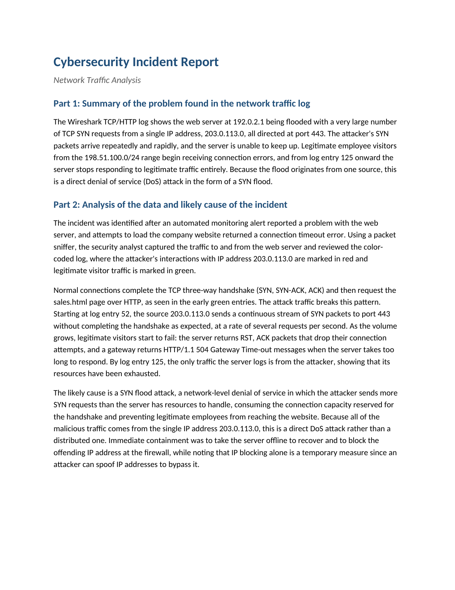

# Network Traffic Analysis: SYN Flood Denial-of-Service Incident

A packet-level investigation of a website outage. Working from a Wireshark
TCP/HTTP capture, I traced why employees could no longer reach the company web
server to a TCP SYN flood from a single source and documented the finding as a
structured incident report.

## 📖 Context

An automated monitoring alert reported a problem with the web server, and
attempts to load the company website returned a connection timeout error. The
security team captured the traffic to and from the server with a packet sniffer
and produced a colour-coded Wireshark TCP/HTTP log, marking the attacker's
interactions with 203.0.113.0 in red and legitimate visitor traffic in green. My
task was to read that capture, identify the point of failure, and write it up in
the standard incident report format.

## ⚙️ Action

I read the TCP/HTTP log as a sequence of connection attempts rather than a flat
list of packets, following the three-way handshake and watching where it broke
down.

- **Established the baseline:** the early green entries show normal connections
  completing the TCP three-way handshake (SYN, SYN-ACK, ACK) and then requesting
  the sales.html page over HTTP. That is what a healthy session looks like in the
  capture.
- **Isolated the attack pattern:** from log entry 52 onward the source
  203.0.113.0 sends a continuous stream of SYN packets to the web server at
  192.0.2.1 on port 443, several per second, without ever completing the
  handshake. The half-open connections never resolve.
- **Traced the impact on legitimate users:** as the volume grows, visitors from
  the 198.51.100.0/24 range start to fail. The server returns RST, ACK packets
  that drop their connection attempts, and a gateway returns HTTP/1.1 504 Gateway
  Time-out messages when the server takes too long to respond. By log entry 125
  the only traffic the server logs is from the attacker, showing its resources
  are exhausted.

I mapped each observation back to a specific point in the capture rather than to
the general symptom, and structured the write-up against the provided report
template.

| Field | Observation from the capture |
|---|---|
| Protocols | TCP for the handshake and flood; HTTP for the page requests |
| Target / attacker | 192.0.2.1 (web server) flooded by 203.0.113.0 |
| Port | 443, the HTTPS port on the web server |
| Attack signature | Continuous SYN packets with no completed handshake |
| Collateral errors | RST, ACK resets and HTTP/1.1 504 Gateway Time-out |
| Timeline | Flood begins at entry 52; server fully unresponsive by entry 125 |

## ✅ Result

The completed report identifies a SYN flood: a network-level denial-of-service
attack in which the attacker sends more SYN requests than the server can hold
open, consuming the connection capacity reserved for the handshake and locking
legitimate employees out of the website. Because all of the malicious traffic
comes from the single address 203.0.113.0, this is a direct DoS attack rather
than a distributed one. The report records the immediate containment — taking the
server offline to recover and blocking the offending IP at the firewall — and
notes the limit of that response: IP blocking alone is temporary, since an
attacker can spoof source addresses to bypass it.

_Full deliverable: [Cybersecurity Incident Report (PDF)](./cybersecurity-incident-report-syn-flood-analysis.pdf)_

## 🧠 What this demonstrates

This lab is foundational security work: transferable fundamentals that support the application security and DevSecOps direction described in the root README, not expert-level practice. It
shows the ability to read a Wireshark TCP/HTTP capture as a sequence of
connection attempts, working knowledge of the TCP three-way handshake and how a
SYN flood abuses it, and the judgement to tell a direct DoS from a distributed
one by attributing the traffic to a single source. It also shows the ability to
record both the finding and the trade-offs of the containment steps in the
incident report format a team would actually circulate.

## 📂 Source materials

The completed deliverable lives in [`source/`](./source/):

- **cybersecurity-incident-report-syn-flood-analysis.docx:** editable source of the completed report.

The Wireshark log, its reference guide, and the report template are course-provided
materials (see attribution below), cited here rather than redistributed.

**Scenario and attribution**

The scenario, the Wireshark TCP/HTTP log, the reference guide, and the report
template are adapted from the Google Cybersecurity Certificate, Module 3: Connect
and Protect, Networks and Network Security (Coursera). The packet analysis, the
finding, and the incident report documented in this lab are my own work.