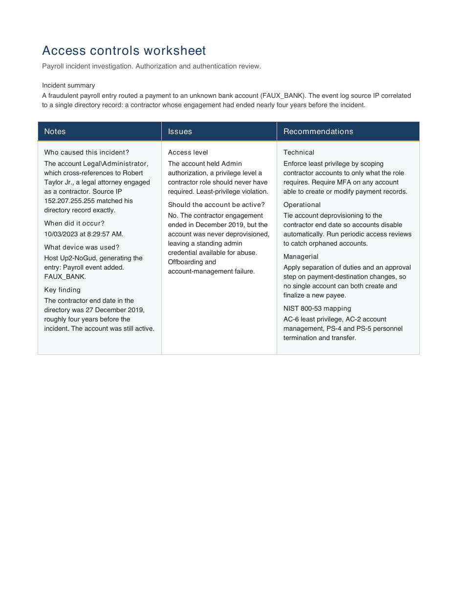

# Access control investigation: orphaned contractor account

A payroll fraud investigation traced to a standing admin credential. Working from
an event log and an employee directory, I correlated a fraudulent payroll entry
back to a contractor account that should have been deprovisioned nearly four years
earlier, and mapped the failure to NIST SP 800-53 controls.

## 📖 Context

A growing business processed a payment to an unknown bank account. The finance
team caught and stopped it, and I was asked to investigate the source and
recommend controls to prevent a recurrence. The company managed resources through
a shared cloud drive and had no clear access-review process. Two data sources were
available: the system event log for the payroll incident and the employee
directory. The objective was to identify who acted, when, and from what device,
then determine which access-control weaknesses made the incident possible.

## ⚙️ Action

I reviewed the event log for the payroll entry and recorded the identifying
fields, then cross-referenced the source IP against the employee directory.

- **Event log:** `Payroll event added. FAUX_BANK`, logged 10/03/2023 at 8:29:57
  AM, from account `Legal\Administrator` on host `Up2-NoGud`, source IP
  `152.207.255.255`.
- **Directory cross-reference:** the source IP resolved to a single record,
  Robert Taylor Jr., a legal attorney engaged as a contractor. His contract end
  date was 27 December 2019, his status was contractor, and his authorization
  level was Admin. The role label matched the `Legal\Administrator` account
  exactly, and the IP matched exactly.

Correlating the two sources established that the account used to create the
fraudulent payment belonged to a contractor whose engagement had ended nearly
four years before the incident.

| Field | Observation |
|---|---|
| Account | `Legal\Administrator` (Robert Taylor Jr., contractor) |
| Timestamp | 10/03/2023, 8:29:57 AM |
| Host / source IP | `Up2-NoGud` / `152.207.255.255` |
| Contract end date | 27 December 2019 |
| Access level at time of incident | Admin |

## ✅ Result

Root cause: an orphaned account. The contractor left the company in December
2019, but the account was never deprovisioned. It remained active with Admin
authorization and was later used to add a payroll event routing payment to an
unknown destination. Two control weaknesses were confirmed: the account held
Admin authorization a contractor role should never have required (a
least-privilege violation), and the account remained active well past the
contractor end date (an offboarding and account-management failure).

Recommended controls, one from each category:

- **Technical:** enforce least privilege by scoping contractor accounts to only
  what the role requires, and require multi-factor authentication on any account
  able to create or modify payment records.
- **Operational:** tie account deprovisioning to the contractor end date so
  accounts disable automatically, and run periodic access reviews to catch
  orphaned accounts.
- **Managerial:** apply separation of duties and an approval step on changes to
  payment destinations, so no single account can both create and finalize a new
  payee.

Framework mapping (NIST SP 800-53): **AC-6** (least privilege), **AC-2** (account
management), **PS-4** and **PS-5** (personnel termination and transfer).

_Full deliverable: [Access Control Worksheet (PDF)](./access-control-worksheet.pdf)_

## 🧠 What this demonstrates

This lab is foundational security work: transferable fundamentals that support
the application security and DevSecOps direction described in the root README,
not expert-level practice. It shows the ability to correlate two independent data
sources, an event log and a directory record, into a single root cause rather
than stopping at the log entry itself, working familiarity with NIST SP 800-53
(AC-6, AC-2, PS-4, PS-5), and the judgement to recommend controls across
technical, operational, and managerial categories rather than a single fix. The
core finding, that a governance gap (missed offboarding) left a standing
credential exploitable, is the same control language used in the data-leak
least-privilege lab and the internal security audit in this section, which is why this lab sits
within the broader governance and risk story rather than as a standalone case.

## 📂 Source materials

**Scenario and attribution**

The payroll incident scenario, the event log, and the employee directory are
adapted from the Google Cybersecurity Certificate, Module 5: Assets, Threats,
and Vulnerabilities (Coursera). The correlation analysis, the control mapping,
and the write-up documented in this lab are my own work.

The supporting document lives in [`source/`](./source/):

- **access-control-worksheet.docx:** editable source of the completed worksheet.
