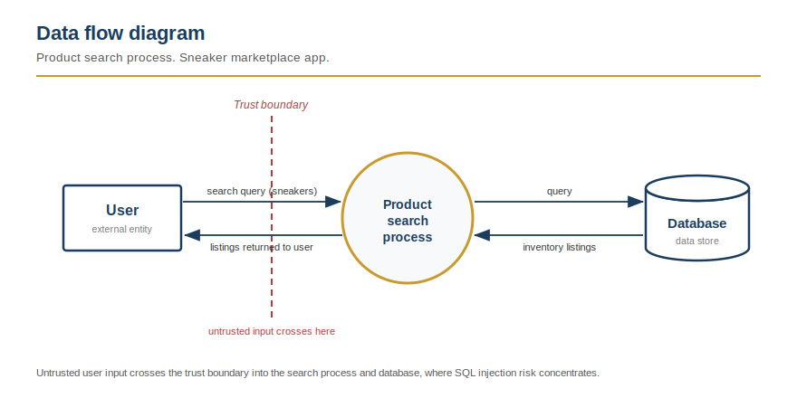
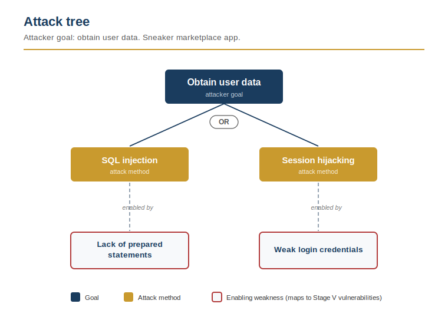
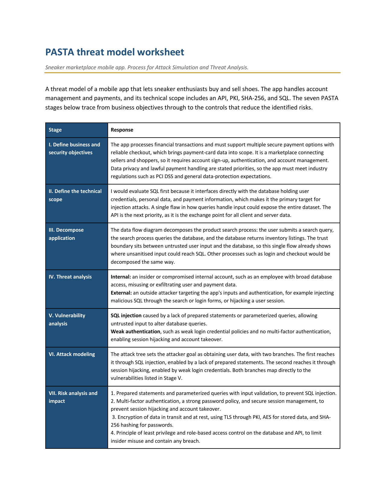

# PASTA threat model: sneaker marketplace app

An application threat model of a payment-handling mobile app, worked through the
seven stages of PASTA (Process for Attack Simulation and Threat Analysis). This
is proactive application-security work — identifying threats and designing
controls before code ships — with a data flow diagram and an attack tree that
trace the same two weaknesses the worksheet lands on.

## 📖 Context

A sneaker marketplace company is preparing to launch a mobile app that lets
enthusiasts buy and sell shoes. The app manages accounts and processes payments,
and its technical scope includes an API, public key infrastructure (PKI),
SHA-256, and SQL. My task was to threat model the application with PASTA to
determine whether it is safe to launch and to define the security requirements it
needs.

## ⚙️ Action

I worked through all seven PASTA stages, keeping each stage traceable to the next
rather than treating them as isolated answers.

- **Objectives and scope:** I set the business and security objectives from the
  product description, then prioritised the technical scope by attack surface —
  SQL and the API rank highest because they carry untrusted input and sensitive
  data.
- **Decomposition:** I decomposed the product search data flow to locate the
  trust boundary, the point where untrusted user input crosses into the process
  and database.
- **Threat and attack modelling:** I identified internal and external threats,
  named the vulnerabilities they would exploit, and mapped both paths onto an
  attack tree.
- **Controls:** I closed with the controls that reduce each identified risk.

The data flow diagram locates where injection risk concentrates — untrusted input
crossing the trust boundary into the database:

## ✅ Result

The model produced a single coherent chain rather than seven disconnected answers.
SQL and the API are the highest-priority technologies because they handle
untrusted input and sensitive data. The product search data flow shows that input
crossing a trust boundary into the database, which is where injection risk
concentrates. Two threats follow — an internal actor misusing database access and
an external attacker targeting inputs and authentication — and they exploit two
vulnerabilities: **SQL injection** from missing prepared statements, and **weak
authentication** enabling session hijacking.

The attack tree confirms both paths reach the same goal of stealing user data,
with each enabling weakness mapping to a Stage V vulnerability:

Four controls close the loop, each removing a specific link in the chain:

- **Prepared statements and parameterized queries** with input validation, which
  removes the SQL injection path.
- **Multi-factor authentication, strong password policy, and secure session
  management**, which removes the session hijacking path.
- **Encryption in transit and at rest** — TLS through PKI, AES at rest, and
  SHA-256 password hashing.
- **Least privilege and role-based access control** on the database and API,
  which limits insider misuse and contains any breach.

The full seven-stage worksheet, from business objectives through to the controls,
is the deliverable:

_Full deliverable: [PASTA Threat Model Worksheet (PDF)](./pasta-threat-model.pdf)_

## 🧠 What this demonstrates

Unlike foundational awareness exercises, threat modelling is core application
security engineering — deriving security requirements before launch rather than
reacting after an incident. This lab shows the ability to run a named methodology
(PASTA) end to end and, more importantly, to keep it traceable: prioritised
technology scope → a data flow that exposes a trust boundary → the vulnerabilities
that concentrate there → an attack tree confirming both paths to the attacker's
goal → controls that each close a specific link. That traceability — every control
justified by a vulnerability, threat, and business objective rather than bolted on
— is exactly what a threat model is meant to demonstrate. The vulnerability classes
and control choices connect directly to the OWASP-based skill track, where
injection and broken authentication are studied mechanically in code.

## 📂 Source materials

**Scenario and attribution**

The sneaker marketplace scenario and the PASTA worksheet template are adapted from
the Google Cybersecurity Certificate, Module 5: Assets, Threats, and
Vulnerabilities (Coursera). The stage-by-stage analysis, the data flow diagram,
the attack tree, and the write-up documented in this lab are my own work.

Supporting artifacts in this folder:

- **[data-flow-diagram.svg](./data-flow-diagram.svg):** decomposition of the product search data flow, showing the trust boundary (Stage III).
- **[attack-tree.svg](./attack-tree.svg):** attacker paths to "obtain user data," mapping each leaf to a Stage V vulnerability.

The completed worksheet lives in [`source/`](./source/):

- **pasta-threat-model.docx:** editable source of the completed seven-stage worksheet.
