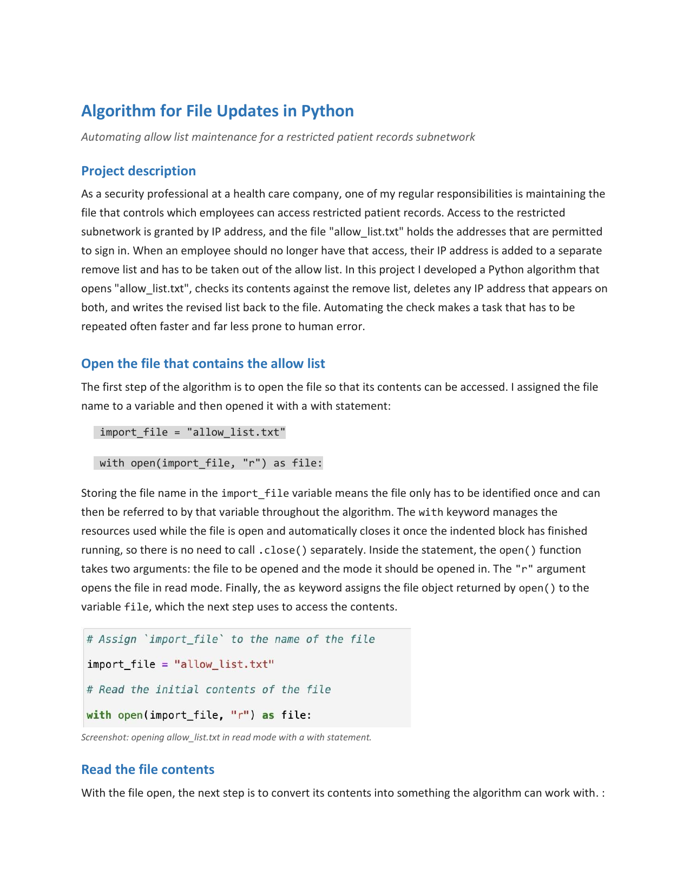

# Python for Security: Automating Allow List Maintenance

A Python algorithm that maintains the IP allow list controlling access to a
restricted patient-records subnetwork. The script opens `allow_list.txt`, checks
its contents against a remove list, deletes any address that appears on both, and
writes the revised list back to the file — turning a recurring, error-prone manual
edit into a repeatable process.

## 📖 Context

As a security professional at a health care company, part of the role is keeping
the file that controls access to restricted patient records current. Access to the
restricted subnetwork is granted by IP address: `allow_list.txt` holds the
addresses permitted to sign in, and when an employee should no longer have access
their address is added to a separate remove list and has to be taken out of the
allow list. Doing that by hand every time an authorization changes is slow and easy
to get wrong. My task was to write an algorithm that reads the allow list, removes
any address that also appears on the remove list, and saves the result.

## ⚙️ Action

I built the algorithm as a read → transform → write pipeline, matching each Python
construct to the step it needed to do.

- **Open the file** — the file name is stored in a variable so it is only named
  once, then opened inside a `with` statement. `with` manages the file resource and
  closes it automatically when the block ends, so there is no separate `.close()`
  call. `open()` takes the file and the mode; `"r"` opens it in read mode, and `as`
  binds the file object to `file`.
  ```python
  import_file = "allow_list.txt"
  with open(import_file, "r") as file:
  ```
- **Read the contents** — `.read()` is called on the file object while the file is
  still open (so this line sits inside the `with` block) and returns the whole file
  as a single whitespace-separated string.
  ```python
      ip_addresses = file.read()
  ```
- **Convert the string to a list** — individual addresses cannot be removed from a
  string, so `.split()` restructures the data. With no argument it splits on
  whitespace (including the line breaks between addresses), giving a list where each
  IP is its own element. This runs outside the `with` block because the data is
  already in memory and the file is no longer needed.
  ```python
  ip_addresses = ip_addresses.split()
  ```
- **Iterate the remove list** — a `for` loop walks `remove_list` rather than the
  allow list, so it only runs as many times as there are addresses to remove, which
  stays efficient as the allow list grows.
  ```python
  remove_list = ["192.168.97.225", "192.168.158.170",
                 "192.168.201.40", "192.168.58.57"]
  for element in remove_list:
  ```
- **Remove matching addresses** — inside the loop a conditional uses `in` as a
  membership test, and `.remove()` deletes the address only when it is actually
  present. Guarding the removal this way avoids the `ValueError` that `.remove()`
  raises on a value that is not in the list. This is safe because the allow list has
  no duplicates — `.remove()` deletes only the first occurrence, so a repeated
  address would leave copies (and access) behind.
  ```python
  for element in remove_list:
      if element in ip_addresses:
          ip_addresses.remove(element)
  ```
- **Write the revised list back** — `"\n".join()` rebuilds the list into one string
  with each address on its own line, preserving the original file format. A second
  `with` statement reopens the file in write mode (`"w"`) and `.write()` overwrites
  it, so the file ends up holding only the addresses that still have authorization.
  ```python
  ip_addresses = "\n".join(ip_addresses)
  with open(import_file, "w") as file:
      file.write(ip_addresses)
  ```

| Construct | Where I used it |
|---|---|
| `with` + `open()` | Opening the file in read (`"r"`) and write (`"w"`) modes |
| `.read()` / `.write()` | Reading the file into a string; overwriting it with the result |
| `.split()` / `"\n".join()` | Converting between the file's string form and a working list |
| `for` loop | Iterating the shorter remove list once per address to remove |
| `if` + `in` membership | Testing presence before removing, to avoid a `ValueError` |
| `.remove()` | Deleting an address that appears on both lists |

## ✅ Result

The deliverable is a complete, runnable Python algorithm that updates the allow
list end to end: it opens `allow_list.txt`, reads and splits the contents into a
list, iterates the remove list, deletes every address that appears on both, rejoins
the survivors with newlines, and overwrites the file with the shortened list. The
outcome is a repeatable process that withdraws an employee's access as soon as their
IP is added to the remove list — the same authorization task done faster and more
consistently than editing the file by hand, and re-runnable whenever the remove list
changes.

[](./algorithm-for-file-updates-in-python.pdf)

_Full deliverable: [Algorithm for File Updates in Python (PDF)](./algorithm-for-file-updates-in-python.pdf)_

## 🧠 What this demonstrates

This lab is foundational security work: transferable fundamentals that support the
application security and DevSecOps direction described in the root README, not
expert-level practice. It shows practical Python for security automation — file I/O
with `with` and `open()`, reading and writing with `.read()` and `.write()`,
converting between strings and lists with `.split()` and `.join()`, iterating with a
`for` loop, and membership-guarded list mutation with `in` and `.remove()`. More
than the syntax, it shows the judgement to turn a recurring authorization task into
a safe, repeatable script: iterating the shorter list for efficiency, and testing
membership before removing so a missing value cannot crash the run. Automating this
kind of access-control maintenance is squarely the DevSecOps direction the root
README builds toward, and it reapplies the Python I already use for scripting to a
concrete security workflow.

## 📂 Source materials

**Scenario and attribution**

The scenario, the `allow_list.txt` file, and the remove list are adapted from the
Google Cybersecurity Certificate, Module 7: Automate Cybersecurity Tasks with Python
(Coursera). The algorithm, the implementation choices, and the write-up documented
in this lab are my own work.

The completed deliverable lives in [`source/`](./source/):

- **algorithm-for-file-updates-in-python.docx:** editable source of the completed
  deliverable.

The Python template and the code-documentation instructions are course-provided
materials (see attribution above), cited here rather than redistributed.
