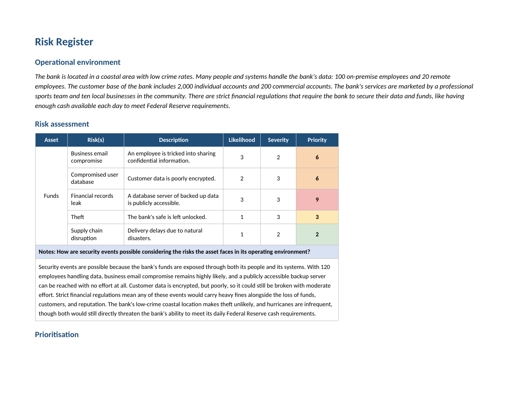

# Risk register: commercial bank

A risk register for a commercial bank, scoring the key risks to the bank's funds
by likelihood and severity, then ordering them by priority. Working from a
description of the bank's operating environment, I built a five-row register,
computed a priority score for each risk, and wrote the reasoning that justifies
the ranking.

## 📖 Context

The bank operates in a low-crime coastal area. Its data and funds are handled by a
large surface of people and systems: 100 on-premise employees and 20 remote
employees, serving 2,000 individual accounts and 200 commercial accounts. The
bank is marketed by a professional sports team and ten local businesses, and it
operates under strict financial regulation, including a requirement to hold enough
cash each day to meet Federal Reserve obligations. My task was to assess the risks
to the bank's funds, score each one, and prioritise them so remediation effort
goes where it reduces the most exposure.

## ⚙️ Action

I scored each risk on two axes and let the product set the priority, so the ranking
followed the evidence rather than intuition.

- **Likelihood (1–3):** how probable the event is given the environment. The large
  human surface and an exposed system push some risks up; the low-crime location
  and infrequent hurricanes pull others down.
- **Severity (1–3):** how damaging the event would be. Under strict financial
  regulation, anything touching customer data or funds carries heavy fines
  alongside the loss of customers, profit, and reputation.
- **Priority = likelihood × severity**, which surfaces the risks that are both
  probable and damaging rather than treating the two dimensions separately.

| Risk | Description | Likelihood | Severity | Priority |
|---|---|---|---|---|
| Financial records leak | A backup database server is publicly accessible | 3 | 3 | **9** |
| Business email compromise | An employee is tricked into sharing confidential information | 3 | 2 | **6** |
| Compromised user database | Customer data is poorly encrypted | 2 | 3 | **6** |
| Theft | The bank's safe is left unlocked | 1 | 3 | **3** |
| Supply chain disruption | Delivery delays due to natural disasters | 1 | 2 | **2** |

## ✅ Result

The deliverable is a completed risk register with a prioritised ranking and the
reasoning behind each score.

- **Financial records leak (9)** is the top priority. The backup server is publicly
  accessible, so the vulnerability takes no effort to exploit, and a leak of
  financial records would bring heavy regulatory fines on top of lost customers and
  profit. Likelihood and severity are both at the maximum.
- **Business email compromise (6)** follows, driven by the large human attack
  surface of 120 employees, any one of whom could be tricked into handing over
  confidential information.
- **Compromised user database (6)** ties on score but for the opposite reason: its
  impact across 2,200 accounts would be catastrophic, but the data is at least
  encrypted, so exploitation takes moderate effort rather than none.
- **Theft (3)** and **supply chain disruption (2)** are the lowest priorities. The
  low-crime location and the infrequency of hurricanes make both unlikely, even
  though each would still directly threaten the daily cash the bank must hold to
  meet Federal Reserve requirements.

_Full deliverable: [Risk Register (PDF)](./risk-register-commercial-bank.pdf)_

## 🧠 What this demonstrates

This lab is foundational security work: transferable fundamentals that support the
application security and DevSecOps direction described in the root README, not
expert-level practice. It shows the ability to translate a description of an
operating environment into a scored risk register, working familiarity with a
likelihood × severity model, and the judgement to rank risks by exposure rather
than by how alarming they sound, distinguishing a zero-effort exploit of an exposed
server from a high-impact but harder-to-reach encrypted database. Prioritising work
by risk is the same discipline that decides which vulnerability advisories and
pipeline findings to fix first.

## 📂 Source materials

**Scenario and attribution**

The commercial bank scenario and the operating environment are adapted from the
Google Cybersecurity Certificate, Module 2: Play It Safe, Manage Security Risks
(Coursera). The risk scoring, the priority calculations, the prioritisation
reasoning, and the write-up documented in this lab are my own work.

The supporting document lives in [`source/`](./source/):

- **risk-register-commercial-bank.docx:** editable source of the completed risk register.
