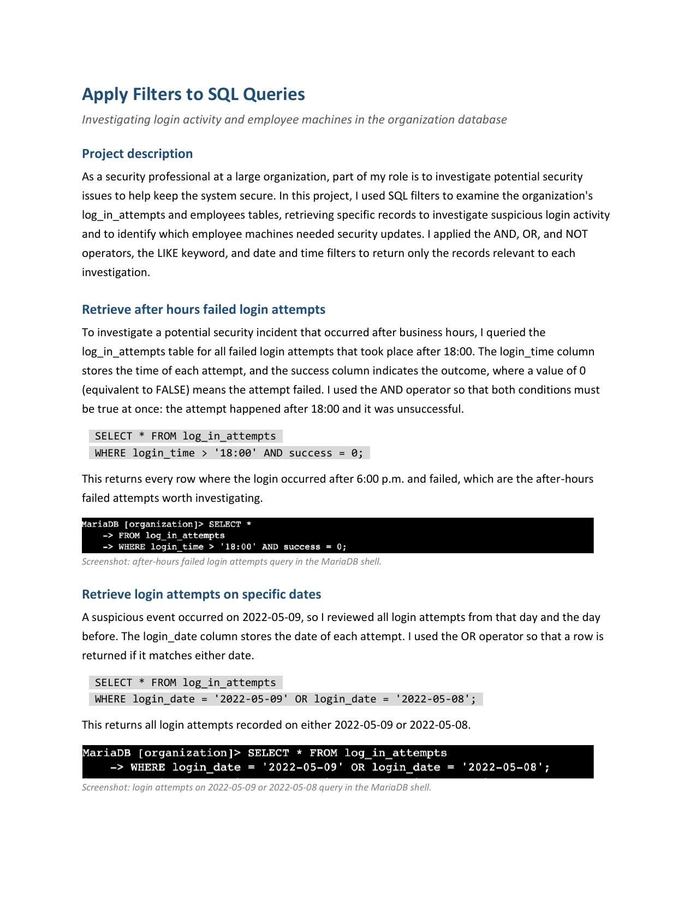

# SQL for Security: Filtering Queries to Investigate Activity

A SQL investigation of an organization's `log_in_attempts` and `employees`
tables. Using filtered queries, I retrieved the specific records needed to look
into suspicious login activity and to identify which employee machines required
security updates.

## 📖 Context

As a security professional at a large organization, part of the role is to
investigate potential security issues and keep systems secure. Two needs drove
this work: a potential security incident around after-hours and specific dates
that called for a review of login activity, and a round of security updates that
needed to target the right machines by department and location. My task was to
write SQL filters that return only the records relevant to each question, rather
than reading entire tables by hand.

## ⚙️ Action

I built each query from the specific condition being investigated, combining
filter operators so every result set was scoped to exactly what the
investigation needed.

**Investigating login activity (`log_in_attempts` table):**

- **After-hours failed logins** — `AND` requires both conditions at once: the
  attempt happened after 18:00 and it failed (`success = 0`, where 0 = FALSE).
  ```sql
  SELECT * FROM log_in_attempts
  WHERE login_time > '18:00' AND success = 0;
  ```
- **Attempts on the days around a suspicious event** — `OR` returns a row if it
  matches either date.
  ```sql
  SELECT * FROM log_in_attempts
  WHERE login_date = '2022-05-09' OR login_date = '2022-05-08';
  ```
- **Attempts originating outside Mexico** — the `country` column holds both `MEX`
  and `MEXICO`, so `LIKE 'MEX%'` matches both via the `%` wildcard, and `NOT`
  excludes them.
  ```sql
  SELECT * FROM log_in_attempts
  WHERE NOT country LIKE 'MEX%';
  ```

**Targeting machines for updates (`employees` table):**

- **Marketing, East building** — `AND` plus `LIKE 'East%'` to match every East
  office (e.g. `East-170`, `East-320`).
  ```sql
  SELECT * FROM employees
  WHERE department = 'Marketing' AND office LIKE 'East%';
  ```
- **Finance or Sales** — `OR` to return either department.
  ```sql
  SELECT * FROM employees
  WHERE department = 'Finance' OR department = 'Sales';
  ```
- **Everyone except IT** (already patched) — `NOT` to exclude one department.
  ```sql
  SELECT * FROM employees
  WHERE NOT department = 'Information Technology';
  ```

| Filter technique | Where I used it |
|---|---|
| `AND` | After-hours failed logins; Marketing + East building |
| `OR` | Attempts on two dates; Finance or Sales employees |
| `NOT` | Attempts outside Mexico; employees not in IT |
| `LIKE` + `%` wildcard | Matching `MEX%` countries and `East%` offices |
| Date / time comparison | `login_time > '18:00'`, `login_date = '…'` |

## ✅ Result

Each query returned only the records relevant to its investigation: the
after-hours failed logins worth reviewing, the login attempts on the dates around
the suspicious event, the attempts that originated outside Mexico, and the exact
sets of employee machines — Marketing/East, Finance-or-Sales, and everyone outside
IT — that needed the security update. Filtering at the query level meant the
investigation worked from precise result sets rather than from whole tables.

[](./apply-filters-to-sql-queries.pdf)

_Full deliverable: [Apply Filters to SQL Queries (PDF)](./apply-filters-to-sql-queries.pdf)_

## 🧠 What this demonstrates

This lab is foundational analyst work, consistent with the SOC analyst trajectory
described in the root README rather than expert-level practice. It shows practical
SQL for security work: filtering with `AND`, `OR`, and `NOT`, pattern matching
with `LIKE` and the `%` wildcard, and filtering on dates and times with comparison
operators. More importantly, it shows the judgement to translate an investigative
question — who failed to log in after hours, which machines still need patching —
into a precise query that returns just those records, which is how an analyst
pulls evidence from log and asset tables in day-to-day operations.

## 📂 Source materials

**Scenario and attribution**

The scenario and the `organization` database (the `log_in_attempts` and
`employees` tables) are adapted from the Google Cybersecurity Certificate
(Coursera). The queries, the filtering choices, and the write-up documented in
this lab are my own work.

The supporting documents live in [`source/`](./source/):

- **apply-filters-to-sql-queries.docx:** editable source of the completed deliverable.
- **apply-filters-to-sql-queries-guide.pdf:** course reference on applying SQL filters, used as background.
- **instructions-for-including-sql-queries.pdf:** reference on documenting SQL queries, used as background.
- **table-formats.pdf:** reference describing the database table formats.
