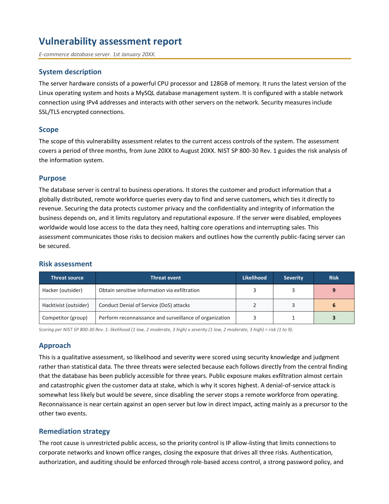

# Vulnerability assessment: publicly exposed e-commerce database

A qualitative risk assessment of a public-facing MySQL server, conducted with
NIST SP 800-30 Rev. 1. Working from a system description and a defined scope, I
selected three threat source and event pairs from the framework's catalog,
scored each on likelihood and severity, and turned the scores into a
decision-ready narrative with a proportionate control set.

## 📖 Context

An e-commerce company stores customer and product data on a remote MySQL
database server running on Linux. A globally distributed, remote workforce
queries the server daily. The server has been open to the public since launch
three years ago, which is the core vulnerability. My task was to assess the risk
this exposure creates and communicate it to decision makers, with the assessment
scoped to the system's access controls over a three-month window.

## ⚙️ Action

I reviewed the system description and scope, then used NIST SP 800-30 Rev. 1 to
structure a qualitative assessment.

- **Selected threats from the framework catalog:** I chose three threat source
  and event pairs, each tied directly to the public-exposure finding rather than
  picked at random.
- **Scored on two axes:** for each pair I scored likelihood and severity on the
  1 to 3 scale defined in the framework and calculated risk as likelihood
  multiplied by severity, so the ranking followed the evidence.
- **Wrote for decision makers:** I turned the scores into purpose, approach, and
  remediation sections that a non-technical reader could act on.

| Threat source | Threat event | Likelihood | Severity | Risk |
| --- | --- | --- | --- | --- |
| Hacker (outsider) | Obtain sensitive information via exfiltration | 3 | 3 | **9** |
| Hacktivist (outsider) | Conduct Denial of Service (DoS) attacks | 2 | 3 | **6** |
| Competitor (group) | Perform reconnaissance and surveillance of organization | 3 | 1 | **3** |

## ✅ Result

The deliverable is a completed vulnerability assessment report with a ranked set
of risks and a remediation plan built around the root cause.

- **Data exfiltration (9)** is the top priority. A public server holding customer
  data makes theft almost certain and its impact catastrophic, so it is
  remediated first — likelihood and severity both at maximum.
- **Denial of service (6)** follows: less likely, but severe because disabling
  the server halts a remote workforce.
- **Reconnaissance (3)** is near certain against an open server but low in direct
  impact, functioning as a precursor to the other two.

Remediation was built around the root cause, unrestricted public access:

- **Network exposure:** IP allow-listing to corporate networks and known office
  ranges, which closes the exposure driving all three risks.
- **Access controls:** authentication, authorization, and auditing enforced
  through role-based access control, a strong password policy, and multi-factor
  authentication, applying least privilege.
- **Data in motion:** current TLS rather than legacy SSL, to defend against
  interception and man-in-the-middle attempts.
- **Availability:** rate limiting and DDoS protection at the network edge to
  reduce the severity of denial-of-service attempts.

Together these controls apply defense in depth across the identified risks.

_Full deliverable: [Vulnerability Assessment Report (PDF)](./vulnerability-assessment-ecommerce-db.pdf)_

## 🧠 What this demonstrates

This lab is foundational security work: transferable fundamentals that support
the application security and DevSecOps direction described in the root README,
not expert-level practice. It shows the ability to apply a named industry
methodology — NIST SP 800-30 Rev. 1 — end to end: scoping the assessment,
selecting threat source and event pairs from the framework catalog, scoring them
on a likelihood × severity model, and reasoning from one root vulnerability to a
ranked set of business risks. The value is not the individual scores but the
chain that connects a single finding to a proportionate, defense-in-depth control
set, and the judgement to communicate it in a decision-ready format. Prioritising
work by risk is the same discipline that decides which vulnerability advisories
and pipeline findings to fix first.

## 📂 Source materials

**Scenario and attribution**

The e-commerce database scenario, the system description, and the report template
are adapted from the Google Cybersecurity Certificate, Module 5: Assets, Threats,
and Vulnerabilities (Coursera). The threat selection, the risk scoring, the
remediation strategy, and the write-up documented in this lab are my own work.

The supporting documents live in [`source/`](./source/):

- **vulnerability-assessment-ecommerce-db.docx:** editable source of the completed assessment report.
- **NIST-SP-800-30-Rev1.pdf:** the NIST risk-assessment framework the assessment was structured against.
