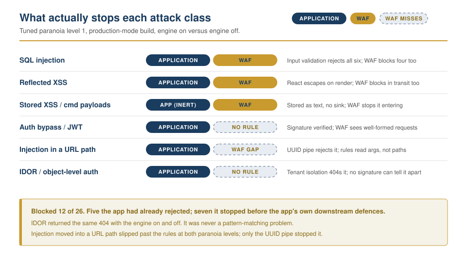
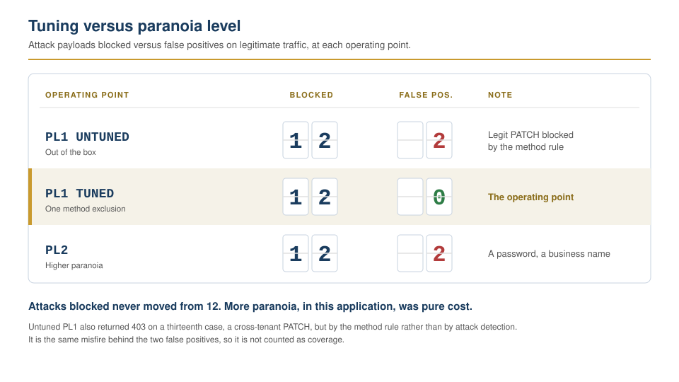

# Runtime defence with a WAF: measuring what it catches, misses, and breaks

A web application firewall put in front of a production application, attacked
directly, and measured against a no-WAF control. The point was never that a WAF
was deployed. It was the measurement, and the argument that follows from it: on
an application that already defends itself, a WAF is a compensating control that
buys response time, not a substitute for fixing the code.

## Context

The target is the same self-hosted product used in the CI/CD security pipeline
lab: a Next.js frontend and a NestJS and Prisma API, behind NGINX, handling
location data on real people. That pipeline gates code before it deploys. This
lab is the runtime layer on the same system. Together they make one argument
about one real application rather than two unrelated demonstrations: static
analysis and dependency, secrets and container scanning before deploy, and a
measured runtime control after.

Attacking a client's application is a different risk profile from reading its
code, so the lab ran against a local replica, not production: the API and
frontend built and run in production mode against a synthetic, disposable
database with two fake tenants, fronted by ModSecurity 3 with the OWASP Core
Rule Set. Production mode was deliberate. In development this application relaxes
its own defences, so measuring a WAF against a development build would have
measured a weaker application than the real one and inflated every result. No
production data, credential, or integration was ever in scope.

The question the lab set out to answer: an application with a CI/CD security
gate already in front of it, and framework-level defences already in the code,
what does a runtime WAF add on top, and at what operational cost?

## Action

The method is what makes this a measurement rather than a demonstration. The
same set of payloads ran in three phases against two listeners: one with the
rule engine live, one an identical TLS and proxy path with the engine off.
Differences between the two are attributable to the WAF, with one known
confound noted honestly: both listeners reach the same application instance and
share its rate limiter, so a small number of control-leg responses are throttle
artifacts rather than WAF effects. Those cases are marked as such in the results
matrix rather than read as WAF behaviour.

<picture>
  <source media="(prefers-color-scheme: dark)" srcset="./what-stops-each-class-dark.svg">
  
</picture>

- **Baselined with no WAF first.** Twenty-six attack payloads across six
  classes, run against the application with the engine off, recording what the
  application itself did with each. Without this control there is no basis to
  claim the WAF caught anything. A seventh class, enumeration and rate abuse,
  was defined and then deliberately left out of the measurement: it is decided
  by the application's throttler and its response wording, not by any signature
  the WAF carries at this paranoia level, so there was nothing for a
  WAF-versus-control comparison to isolate.

- **Built the target to measure the real application, not a softer one.**
  Running in production mode meant CSRF was enforced, the API documentation was
  not served, and session cookies were marked secure, all of which a
  development build would have dropped. Two synthetic tenants were seeded so
  that cross-tenant object access could be tested as an authorisation question,
  which is what IDOR actually is, rather than as guesswork.

- **Ran detection-only before blocking.** ModSecurity in `DetectionOnly` at
  paranoia level 1, so the WAF logged what it would have blocked without
  breaking anything. Every payload was rerun, then legitimate application
  traffic was run through it: a signed GPS-ingest webhook, JSON bodies with
  coordinate arrays, long JWTs, names with apostrophes and punctuation, unicode,
  ISO timestamp ranges. Detection first is how this rolls out on a real system:
  measure the false positives before you let the thing block.

- **Moved to blocking and tuned by exclusion, not by lowering paranoia.** The
  false positives that surfaced were fixed with one targeted rule exclusion,
  documented and justified, rather than by weakening the ruleset wholesale. Then
  the paranoia level was raised to 2 to chart the trade-off rather than report a
  single data point.

- **Kept the evidence machine-readable.** Every request carried a case
  identifier, and ModSecurity's JSON audit log was joined back to it, so every
  figure below is reproducible from the captured evidence rather than tallied by
  hand.

## Result

Lead with the measurement. Of twenty-six attack payloads at a tuned paranoia
level 1, the WAF blocked twelve. Every one of those twelve was already handled
by the application on its own. It blocked zero payloads that the framework did
not also stop, and the one measured class capable of causing a real breach here,
cross-tenant object access, passed through it untouched.

**What the framework already handled, with no WAF.** SQL injection never
reached a query in any case. Input validation rejected all six first: the UUID
pipe on id routes, email validation on login, and an explicit date check on the
history endpoint's range parameters, each returning 400 before a query was
constructed. Prisma's parameterisation sits behind that as the backstop that
would have bound any payload as a literal had one gotten through, but in this
test none did. Reflected cross-site scripting was escaped by React on render. Forged and tampered JWTs were rejected by signature
verification. Path traversal and command injection reached no file or shell
sink. Stored payloads persisted as inert text. The application's response to
the payload set with no WAF present was to neutralise all of it.

**What the WAF genuinely added.** It blocked cross-site scripting and stored
payloads in transit, before they reached the application at all. On this
application that is defence in depth over controls that already hold, but it is
a real contribution: it is the layer that would still catch a payload if a
future template rendered something unescaped.

**What no WAF can address, stated plainly.** Cross-tenant object access, one
tenant reaching for another's records, is a perfectly well-formed request. No
signature distinguishes it from a legitimate read; the two differ only in whose
data the identifier belongs to. Every such case passed the WAF's attack rules
and was stopped by the application's own tenant isolation, entirely outside the
firewall. This is the class that decides real breaches, and it is precisely the
one the WAF is structurally blind to.

There is one instructive exception, and it proves the point rather than
softening it. Before tuning, the WAF did return 403 on one cross-tenant case:
the one delivered as a PATCH. It was not detected as an attack; it was caught by
the method-enforcement rule described below, the same misfire that was blocking
legitimate updates. The WAF stopped it for a reason that had nothing to do with
the attack, and fixing the false positive removed the block. An accidental
403 on the right request for the wrong reason is not coverage.

**A bypass found by placement.** SQL injection and command injection that the
WAF caught in a query string or JSON body, it missed entirely when the same
payload sat in a URL path segment, at both paranoia levels: the core injection
rules inspect arguments, not path segments. Traversal coverage on path segments
was inconsistent rather than absent, a double-encoded traversal in one route
was caught while plain and dot-slash variants in another were not. In this
application the path-segment injection cases target an id route guarded by UUID
validation, so the application rejects them regardless of the WAF, but that is
the framework's control, not the firewall's, and it does not extend to routes
that take a non-UUID path token. Against an application that consumed a raw path
segment, the injection gap would be a live bypass at every level tested. Finding
and documenting one such gap is worth more than the dozen payloads the WAF
caught cleanly.

**The tuning was the most realistic part, and the first false positive was not
where the reputation says it is.** The feared content false positives on a JSON
API, on coordinate arrays and long tokens, did not appear at paranoia level 1.
The real false positive was structural: the Core Rule Set blocks the PATCH and
DELETE methods by default, and this is a REST API that depends on both.
Untuned, the WAF returned 403 on every legitimate profile edit and record
update. It was fixed with a single exclusion restoring the standard verb set,
placed so it takes effect before the rule that enforces the policy, changing the
method policy and nothing else. Every attack block survived the change.

<picture>
  <source media="(prefers-color-scheme: dark)" srcset="./paranoia-tradeoff-dark.svg">
  
</picture>

**The paranoia trade-off resolved against more paranoia.** Raising to level 2
caught nothing the tuned level 1 did not. It fired more rules on attacks already
blocked, and it introduced two fresh false positives on legitimate traffic: a
strong password containing a comment sequence, and a business name containing an
ampersand and angle brackets. For this application, level 2 is strictly worse
than a tuned level 1: real cost, no gain. The correct operating point is a tuned
level 1.

The complete per-case results across all phases are in
[evidence/results-matrix.md](./evidence/results-matrix.md), generated from the
raw logs. The one exclusion applied is in
[config/crs-exclusions.conf](./config/crs-exclusions.conf), commented with its
justification.

## What this demonstrates

This is the runtime half of a single position on one production system: gate the
code before it ships, then measure exactly what a runtime control does and does
not add on top. The conclusion is not that the WAF is worthless. It is that on
an application whose framework already parameterises its queries, escapes its
output, verifies its tokens, and isolates its tenants, the WAF's honest value is
narrow and specific: it blocks known payloads in transit and buys time to
respond, and it leaves broken object-level authorisation, the one breach-class
this lab actually measured it against, exactly where it found it, as the
application's own problem to solve. By the same structural logic it is blind to
business-logic flaws, which this lab did not test but which no signature can
reach either. A WAF sold as a fix for those is sold
dishonestly. Measured as a compensating control, it earns its place and no more.

The work also surfaced a genuine reliability defect in the application, found
while building the harness rather than by any scanner. It was reported to the
engineering team privately with a root-cause analysis and a fix, and its details
are kept out of this public writeup by the same rule the CI/CD lab followed. The
public artifact is about WAF efficacy, not about the product's vulnerabilities.

## Source materials

The private engineering record, including the running lab, its credentials, the
raw audit logs, and the application defect, stays out of this repository. This
lab includes what documents the method without exposing the product:

- **[analysis.md](./analysis.md):** this writeup.
- **[Published blog post](https://lawaloyinlola.com/blog/what-my-waf-actually-blocked)**
  and **[LinkedIn briefing](https://lnkd.in/p/d_SXgSJ3):** the public write-ups of
  what the WAF actually blocked, missed, and broke.
- **[payloads/test-cases.md](./payloads/test-cases.md):** the payload set and
  the expected application behaviour reasoned out ahead of each run.
- **[config/](./config):** the one CRS exclusion applied, with the NGINX and
  ModSecurity settings that shaped the measurement.
- **[evidence/results-matrix.md](./evidence/results-matrix.md):** every case,
  every phase, generated from the raw logs.
- **What stops each class
  ([light](./what-stops-each-class-light.svg), [dark](./what-stops-each-class-dark.svg))**
  and **the tuning trade-off
  ([light](./paranoia-tradeoff-light.svg), [dark](./paranoia-tradeoff-dark.svg)):**
  the diagrams above, as standalone files. The page shows whichever matches your
  theme.
